# A Survey on Knowledge Graphs: Representation, Acquisition and Applications

人类知识提供了对世界的正式理解。表征实体间结构关系的知识图已成为认知和人类智能研究的一个日益流行的研究方向。

本次讨论的框架图如下：
 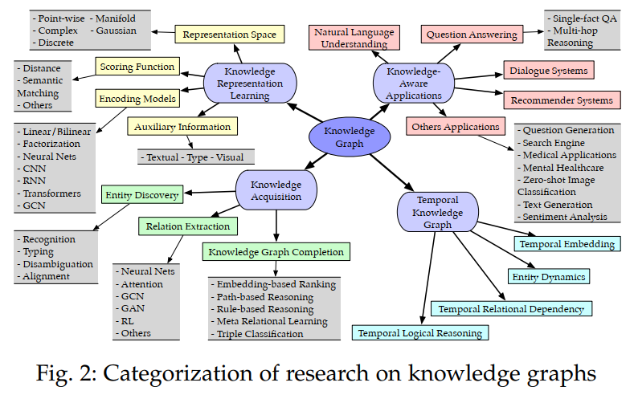

## 1. knowledge representation learning (KRL) or knowledge graph embedding (KGE)

本文种将知识图谱定义为三元组表示，即  $(h, r, t)$，理解为：$(head, relation, tail)$ 。
我们根据头部和尾部参数的基数将关系分为四类:***1-TO-1, 1-TO-MANY, MANY-TO-1, MANY-TO-MANY。 对称、反对称、翻转、组合等关系。***

知识表示学习是知识图谱的一个重要研究课题，它为许多知识获取任务和后续应用奠定了基础。下面可以4个方面来讨论KRL：

- _**representation space**_ in which the relations and entities are represented
- _**scoring function**_ for measuring the plausibility of factual triples
- _**encoding models**_ for representing and learning relational interactions
- _**auxiliary information**_ to be incorporated into the embedding methods

表示学习包括向量空间、流形空间、复向量空间、高斯分布空间和离散空间。
评分指标一般分为基于距离的评分函数和基于相似度匹配的评分函数。
目前的研究主要集中在编码模型，包括线性/双线性模型，因式分解和神经网络。
辅助信息包括文本信息、可视信息和类型信息。

### 1.1 representation space

表示学习的关键问题是学习实体和关系的低维分布式嵌入向量。
不同空间知识表示如下图：
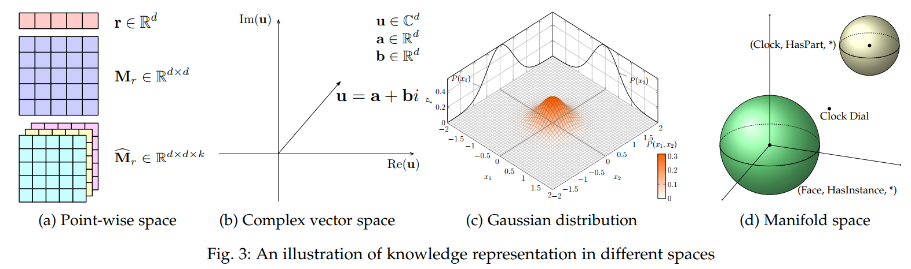

### 1.2 scoring function

评分函数用于度量事实的可信性，在基于能量的学习框架中也称为能量函数。评分函数有两种典型类型，基于距离和基于相似性的函数。

- ***基于距离的评分函数***通过计头尾算实体之间的距离来衡量事实的可信性，其中使用较多的是带有$h$(头实体) + $r$(关系) ≈ $t$(尾实体)关系的翻译。

- ***基于语义相似度***的评分方法是通过语义匹配来衡量事实的可信性，通常采用乘法矩阵公式。

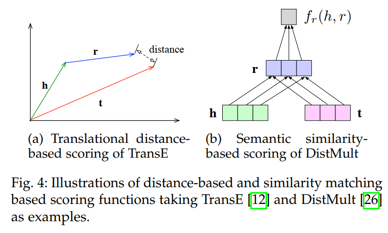

***Distance-based Scoring Function***：

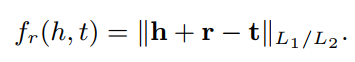

- 代表：TransE, TransR, TransH, TransD, TransA, KG2E, ITransF, TransAt, TransMS, TransF,

***Semantic Matching***：

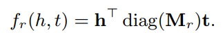

- 代表：DistMult， HolEx， HolE，TorusE, DihEdral, 

### 1.3 encoding models

知识表示学习模型如下图所示：

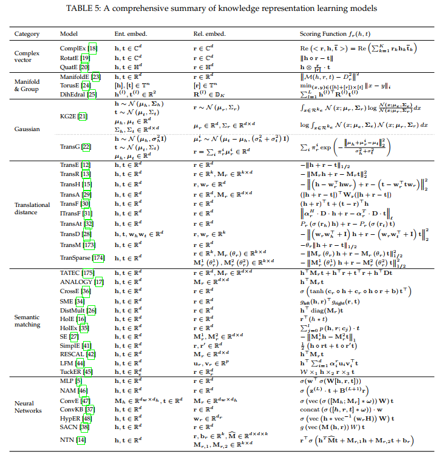

#### 1.3.1 TransE(2013)

***TransE***解决在***低维向量空间***中多关系数据的实体和关系表示问题。
基本思想是，当两个实体属于同一个三元组时，它们的嵌入应该在某个依赖于关系的子空间中彼此接近。即$ t $可以看成是在$ h + r $的领域里。

在向量空间的表示如下图：

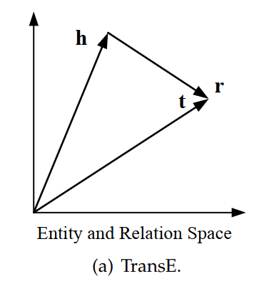

training set: $ S = {(h, l, t)| h, t \in E, l \in R} $

loss function: 

  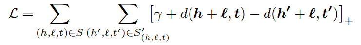

其中：距离公式为：$ d(h+l,t) = || h + l - t ||_{L1|L2}$,   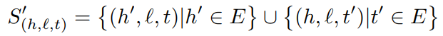

optimization objective: $ min(L) $

- 解释：
    - （1）要前面的项变小（positive），后面的项变大（negative）。前面的项是对的（来自于训练集），后面的项是错的（随机生成的）。不同时改变主体和客体，随机挑选一个改变，另一个保持不变，这样才能够有对照性。
    - （2）采用margin-based ranking criterion（大于0取原值，小于0则为0），尽可能将对的和错的分开，margin值一般设为1。
    - （3）模型的参数：参数θ是所有实体的向量。设一共有 |E| 个实体和 |R| 个关系，每个实体/关系的向量长度为d维，因此，一共有（ |E| + |R| ） *  d 个参数。

- 优点：
    - (1)TransE模型是一种更直接的方法来表示关系的真实属性，
    - (2)模型的参数少，简单容易扩展，并且在大规模稀疏知识库上也同样具有较好的性能与可扩展性。（相比于Structured Embeddings（SE），只是将实体转为向量，关系是一个矩阵，利用矩阵的不可逆性反映关系的不可逆性。）

- 缺点：
    - (1)***不能解决复杂的关系***（一对多，多对一，多对多）

            姜文拍的民国三部曲电影为例，即《让子弹飞》、《一步之遥》和《邪不压正》。
            三元组：（姜文，导演，让子弹飞）、（姜文，导演，一步之遥）和（姜文，导演，邪不压正）
            transE: 让子弹飞≈一步之遥≈邪不压正。但实际上这三部电影是不同的实体，应该用不同的向量来表示。
        

#### 1.3.2 TransH(2014)

背景：
- ***为了解决TransE中存在的一对多、多对一、多对多问题而提出的。***

核心思想：

- 作者从关系的角度出发，目的是使得同一个实体在不同关系中的意义不同，同时不同实体，在同一关系中的意义，也可以相同。

- ***每一个关系定义一个超平面***$ W_r $， 和一个关系向量$ r $， TransH模型就可以使用关系向量和超平面向量来建模。
对于三元组$(h, r, t)$中的实体$ h, t $可以表示如下：

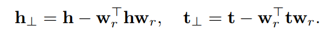

对于超平面$ W_r $，可以用法向量$ w_r $来表示，这样就可以得到$ h $在$ w_r $上的投影为：
$ h_{w_r} = w_r^Thw_r$，这里约束为：$ ||w_r||_2^2 = 1$。

打分函数：

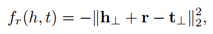

在向量空间的表示如下图：

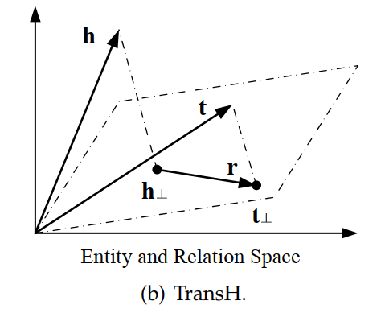

#### 1.3.3 TransR(2015)

***一个实体可能有多个方面，各种关系可能集中在实体的不同方面***，因此，可以直观地看出，在实体空间中，有些实体是相似的，因此相互接近，但在某些特定方面是相异的，因此在相应的关系空间中是相距甚远的。这使得一个公共空间不足以进行建模。
虽然TransH模型使每个实体在不同关系下拥有了不同的表示，它仍然假设实体和关系处于***相同的语义空间中***，这一定程度上限制了TransH的表示能力。

***TransR模型则认为，一个实体是多种属性的综合体，不同关系关注实体的不同属性。TransR认为不同的关系拥有不同的语义空间***。

特定于关系的投影可以使实际持有关系的头/尾实体(用有色圆圈表示)彼此靠近，并远离那些不持有关系的实体(用有色三角形表示)。如下图所示：

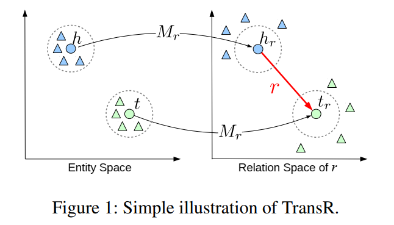

打分函数：

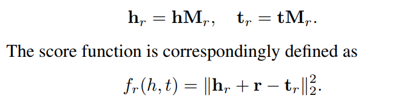

在向量空间的表示如下图：

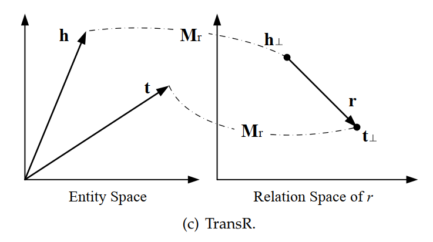

补充：

CTransR是对TransR的扩展，它将不同的头尾实体对聚类成组，并为每个组学习不同的关系向量。

#### 1.3.4 TransD(2015)

背景：
***TransR有以下缺点***：

- 1)在同一个关系:下，头、尾实体共享相同的投影矩阵。然而，一个关系的头、尾实体的类型或属性可能差异巨大.例如，对于三元组(美国，总统，奥巴马)，***美国和奥巴马的类型完全不同，一个是国家，一个是人物***。

- 2)从实体空间到关系空间的投影是实体和关系之间的交互过程，因此TransR让投影矩阵仅与关系有关是不合理的。

- 3)与TransE和TransH相比，TransR由于引入了空间投影，使得TransR模型参数急剧增加，计算复杂度大大提高。

然而，不同类型的实体具有不同的属性和功能，仅让它们共享关系的相同转换参数是不够的。对于一个给定的关系，相似的实体应该有相似的映射矩阵，否则就应该有不同的实体。

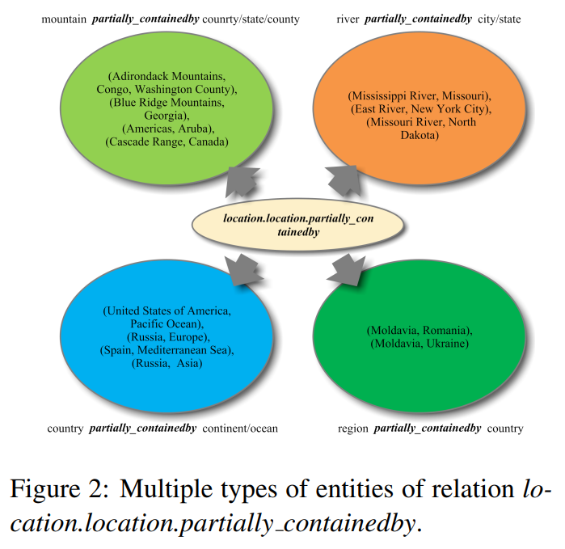

***核心思想***：

- 实体和关系映射到不同的空间中，用两个向量表示实体或关系，一个$(h,r,t)$ 表征实体或关系，另一个$(h_p, r_p,t_p)$用来构造动态映射矩阵。

- 投影操作是一个实体与关系之间的交互过程，单纯用关系来确定映射矩阵是不合理的，

- 第一个向量表示一个实体或关系的意义，另一个向量(称为投影向量)表示如何将一个实体投影到关系向量空间中，并将其用于构造映射矩阵。因此，每一个实体-关系对都有一个唯一的映射矩阵。

打分函数：

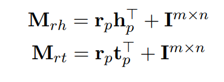

映射矩阵由实体和关系决定，这种操作使两个投影向量充分交互，因为它们的每个元素都可以满足来自另一个向量的每一项。

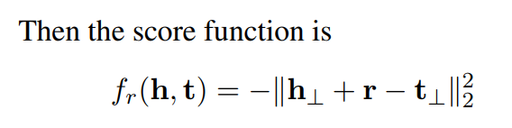

在向量空间的表示如下图：

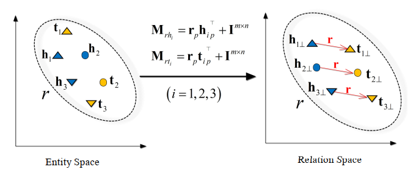

优点：
- ***TransD参数较少***，没有矩阵向量乘法运算，可以应用于大型图数据。

  

#### 1.3.5 TransA(2015)

尽管这些方法取得了成功，但基于translation-base的方法也存在过度简化的损失度量，并且在知识库中对各种复杂实体/关系建模方面缺乏足够的竞争力。
为了解决这一问题，我们提出了一种自适应的度量方法TransA，利用度量学习思想提供了一种更灵活的嵌入方法。

问题：
- 如何解决了translation-based 知识表示方法存在的过于简化损失度量，没有足够能力去度量/表示知识库中实体/关系的多样性和复杂性的问题。 

方案：
- 更换度量函数，区别对待向量表示中的各个维度，增加模型表示能力。

得分函数：

- 对于其他基于平移的方法，等势超曲面是欧几里得距离定义的球面，对于TransA，等电位超表面是马氏距离绝对损失状态下的椭圆表面

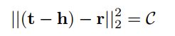

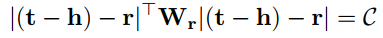

注意，椭圆超曲面在绝对算符作用下会有一点变形，但这对分析TransA的性能没有影响。

不同的等势超曲面对应不同的阈值，不同的阈值决定了三元组是否正确。由于实际情况，我们的知识库规模较大且非常复杂，嵌入的拓扑不能像球体一样均匀分布，如下图所示。因此，用椭圆等势超曲面代替球面等势超曲面可以增强嵌入。

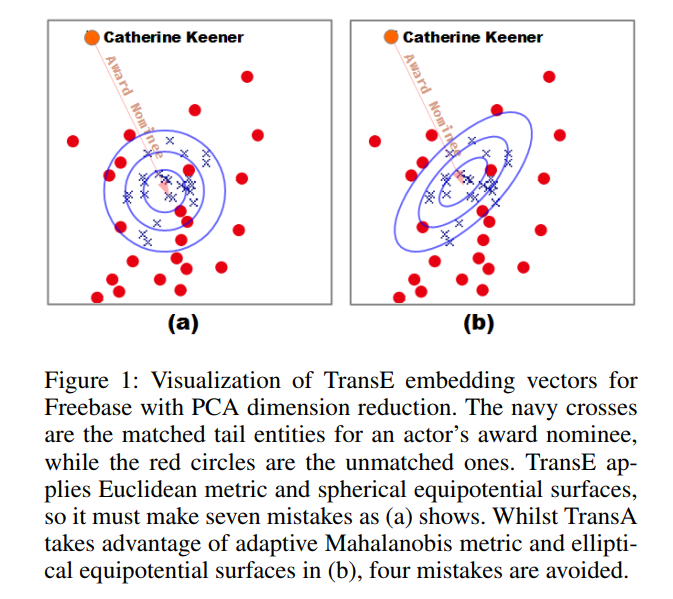

如上图所示，TransA对于一对多的关系执行得更好。TransA的度量是对称的，因此TransA在多对一关系中也会执行得更好是合理的。此外，多对多关系可以同时视为多对一关系和一对多关系。一般来说，对于所有复杂的关系，TransA会执行得更好。

#### 1.3.6 ComplEx(2016)

knowledge bases 将数据表示为有向图，在节点（实体）之间带有标记的边（关系）. 记录的关系中的一些冗余可以用来填充知识库中缺失的条目，例如，并非所有实体都有CountryOfBirth关系，但是如果知道CityOfBirth关系，则可以推断出CountryOfBirth。Link Prediction 的目的就是自动地发现这种规律。但现实中许多关系是不确定的，例如，IsBornIn（John，Athens）和IsLocatedIn（Athens，Greece）这两个事实的组合并不总是意味着HasNationality（John，Greece）。因此，可能需要以概率的方式处理涉及到这些关系或实体的其他事实。

有一种办法是把链路预测问题转化为3D的二进制张量补全问题(a 3D binary tensor completion), 其中一个slice 就是知识图谱中某一种关系的邻接矩阵。随着Netflix搞得推荐系统大赛，基于低秩因式分解或者基于基于嵌入的补全已经得到广泛推广。将部分观测到的矩阵/张量分解为秩较小的嵌入矩阵的乘积，从而为数据库中的每个实体和关系生成固定尺寸的矢量表示形式。对于一个给定的事实$r(s,o)$, 定义得分函数为$s,r,o$的嵌入向量的多线性乘积。但因为实数向量之间的点积计算是具有交换性的，使用点积不好处理非对称的关系。

***复数空间中的共轭向量使得传统的点积可以在不对称关系中用起来***。

当使用复向量时，即在复空间C中表示的向量，点积通常定义为Hermitian点积[1]，它是有序的，**意味着反对称关系可以处理，根据所涉及实体的顺序而获得不同的分数。复向量空间可以描述不对称关系，同时保留点积的效率优势，即空间和时间复杂度均为线性。**

得分函数：

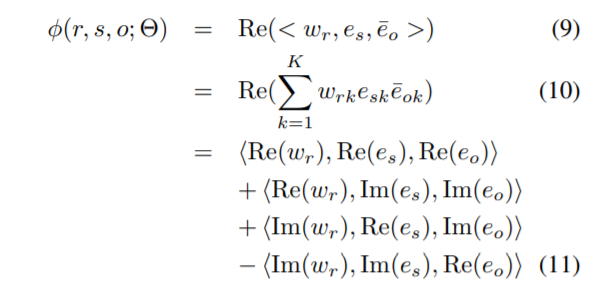

loss function:

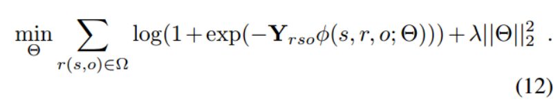

#### 1.3.7 RotatE(2019)

传统的链接预测的方法并不能胜任知识图谱补全。该文章旨在通过学习知识图谱中实体和关系表示的问题以预测连接（关系推断）。

文章提出了一种称为RotatE的知识图谱嵌入的新方法，该方法能够建模和推断各种关系模式，包括：***对称，反对称，反转和组合***。 具体而言，RotatE模型将每个关系定义为在复矢量空间中从**源实体到目标实体的旋转**。 此外，我们提出了一种新颖的自我对抗式负采样技术，可以有效地训练RotatE模型。

通过多个基准知识图上的实验，结果表明，RotatE模型不仅具有可伸缩性、而且还能够推断和建模各种关系模式，明显优于现有的用于链路预测的模型。

问题：

现实中的知识图谱通常是不完整的，因此知识图谱的一个首要问题就是预测缺少的链接。 最近，已经进行了广泛的研究，以学习实体和关系的低维表示形式以进行缺失链接预测（又称为知识图谱嵌入）。大多是根据观察到的知识事实对知识图中的连接模式进行建模从而进行推断的。举个例子，有些关系是对称的--symmetric（如：婚姻），有些关系是反对称的anti-symmetric--（如：孝顺），有些关系与其他关系相反（例如，上位词和下位词），有些关系可能是由其他人建立的（例如，我母亲的丈夫是我父亲）。总直，都是从观察到的事实中找到建模和推断这些模式（即symmetry / anti-symmetry, inversion, 和 composition）的方法作链路预测。

文章提出了RotateE模型作知识图谱嵌入。该模型的启发来源于欧拉分解：$e^{i \theta} = cos(\theta) + i sin(\theta) $ ，该式说明任何一个复数都可以看作复平面上的一个旋转向量（rotation）。具体来说，**RotatE模型将实体和关系映射到复数向量空间，并将每个关系定义为从head实体到tail实体间的旋转**。

目标函数：

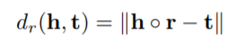

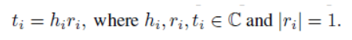

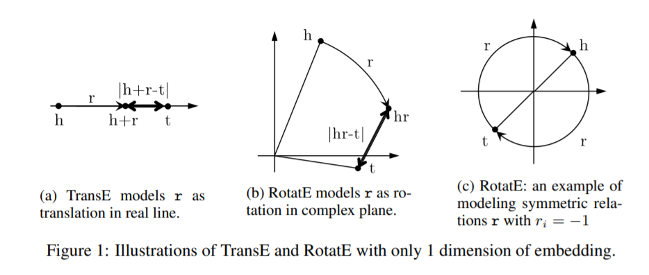

可以很好对这几种关系进行建模symmetric， antisymmetric, inversion, 和 composition.

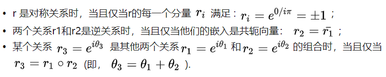

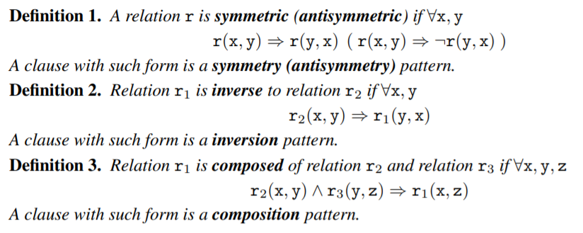

#### 1.3.8 QuatE(2019)

方法：

关系在四元数空间中被建模为旋转。**四元数也比旋转矩阵更有效和更稳定**。

优点：
- 潜在的相互依赖关系(在所有组件之间)是恰当地捕捉汉密尔顿乘积，鼓励实体和关系之间更紧密的互动。
- 四元数能够在四维空间中表达旋转，比复杂平面中的旋转具有更多的自由度
- 所提出的框架是对在超复杂空间上的复数，同时提供更好的几何解释，同时满足关系表示学习的关键需求(对称、反对称、反转)

定义：

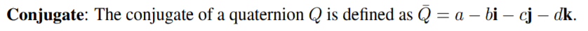

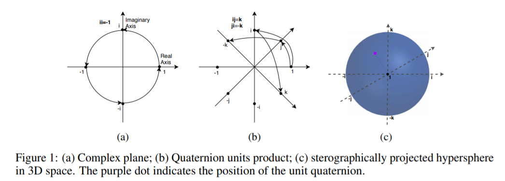

步骤：

- 使用单元关系四元数旋转头部四元数
- 取旋转头部四元数与尾部四元数之间的四元数内积，对每个三元组进行评分

如果在KG中存在一个三个一组，模型会将头部实体与关系进行旋转，使头部与尾部实体之间的角度变小，从而使产品最大化。否则，我们可以使头和尾实体正交，使它们的乘积为零。

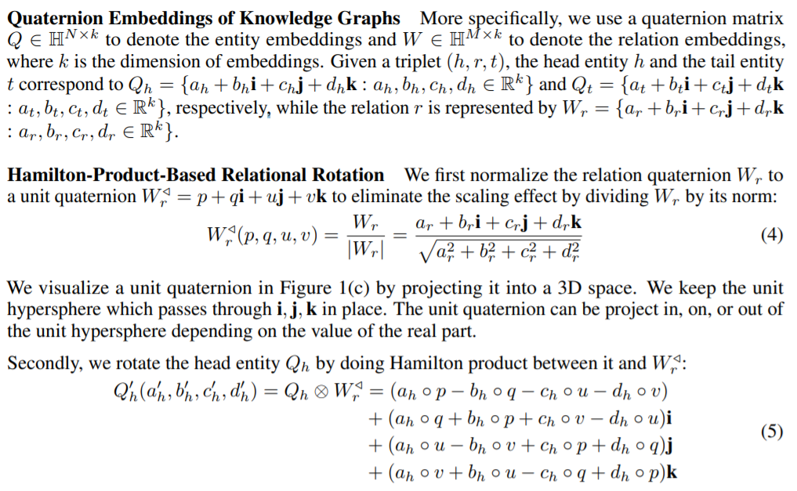

loss function：

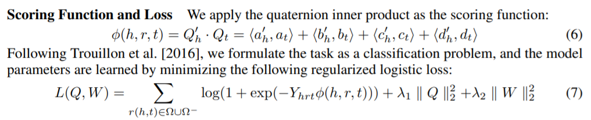

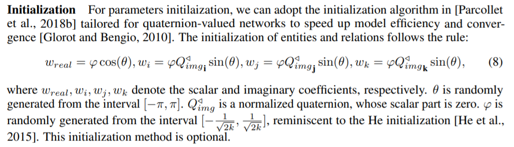

#### 1.3.9 KG2E(2015)

为了解决 point-wise space 中的嵌入问题。

事实上，不同的实体和关系可能包含不同的确定性，这使得相同的确定性不足以进行建模。

***本文转换到基于密度的嵌入，并提出了KG2E来明确地建模实体和关系的确定性，从而学习了KGs在多维高斯分布空间中的表示***。

***思想***：

- 使用Gaussian Distribution 来表示实体和关系，提出了用Gaussian Distribution的协方差来表示实体和关系的不确定度的新思想，提升了已有模型在link prediction和triplet classification问题上的准确率。

**每个实体/关系都用高斯分布表示，其中均值表示其位置，协方差(目前为对角协方差)可以恰当地表示其确定性**。

此外，与基于点的方法中使用的对称测度相比，我们使用**$KL$散度**对三联体进行评分，这是一种自然的不对称函数，可以有效地对多种关系进行建模。

背景：

这个数字表明，受欢迎的实体(如政治家希拉里·克林顿)比不受欢迎的实体(如作家默里·西尔弗斯坦)包含更多的关系和事实。此外，关系的不同部分可以包含非常不同数量的实体(例如性别或国籍中的头部分和尾部分)，并且，高频关系(例如国籍)比低频关系(例如宗教)链接更多的实体对。

在一个KG中，不同实体和关系的不确定性变化是非常大的，在学习潜在空间中KG的表示时，最好考虑这个问题。

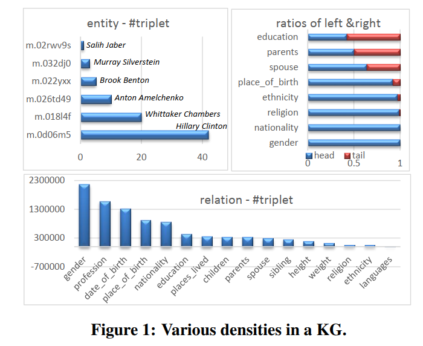

目标函数：

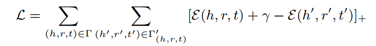

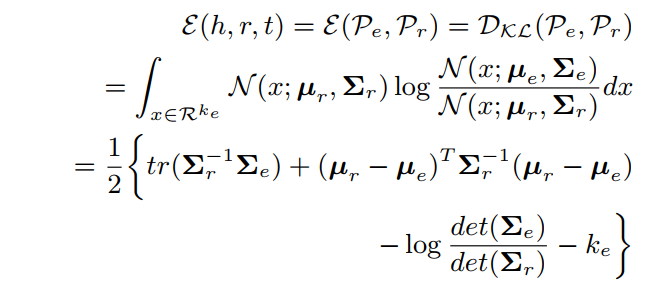

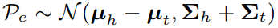

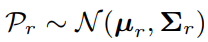

步骤：

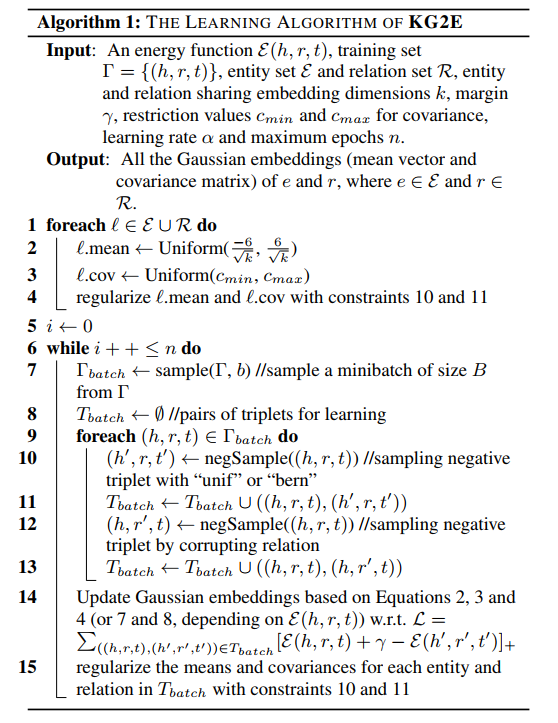

#### 1.3.10 TransG(2016)

问题：

- ***解决多关系语义的问题***，同一种关系在语义上是不同的，eg, (Atlantics, HasPart, NewYorkBay)与(Table, HasPart, Leg)。
- 关系向量具有多语义性。比如，同样是has_part关系，(Table, HasPart, Leg)表示的是一种成分关系，而(Atlantics, HasPart, NewYorkBay)则表示一种地域关系。在知识库Freebase中，同样是“出生地”的关系，(Jon Snow, birth place, Winter Fall) 和 (George R. R.Martin, birth place, U.S.)分别被映射到了两个不同的schema：/fictional universe/fictional character/place of birth（虚拟人物出生地）和/people/person/placeof birth（现实人物出生地）。

方案：

- 利用贝叶斯非参数高斯混合模型对一个关系生成多个翻译部分，根据三元组的特定语义得到当中的最佳部分。

- 为了刻画关系的多语义性问题，一个关系应该有多种向量表示，不同的实体对在几何变换中应该采用不同的关系向量。因此，就提出了一种基于贝叶斯非参的无限混合嵌入模型：认为关系向量由若干子成分向量合成，模型会根据实体对自动选择一个关系向量，而多少个这样的关系向量还可以由模型自动选择。

这个模型在链接预测（link prediction，给定一个实体和关系，预测另外一个实体）、三元组分类（即判断一个三元组是否是一个正确的知识）中，全都去得到了最好的性能。

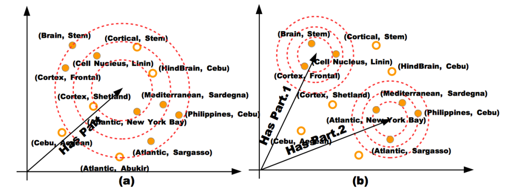

模型的生成过程如下:

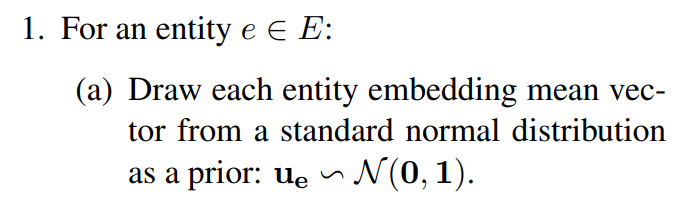

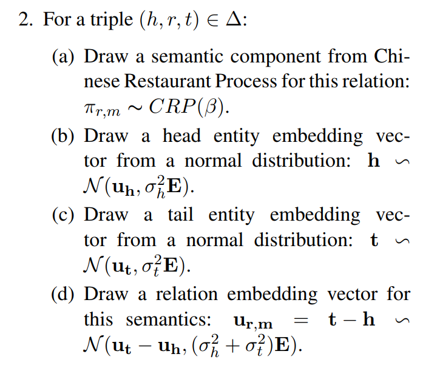

 score function：

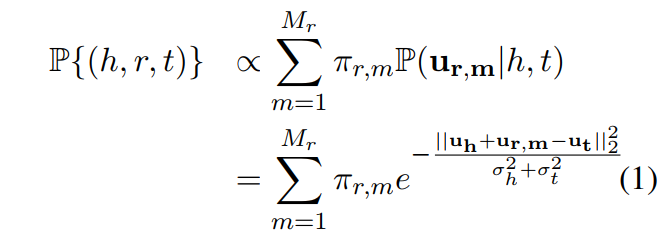

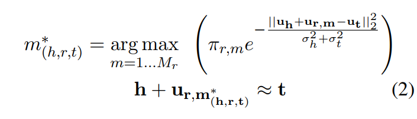

#### 1.3.11 ManifoldE(2016)

目前已有的知识表示学习方法无法实现精确链接预测，本文认为有两个原因导致了这一现象的出现：***ill-posed algebraic problem、adopting an overstrict geometric form。***

其中，ill-posed algebraic problem指的是：一个方程组中的方程式个数远大于变量个数。本文以翻译模型为代表叙述这一问题。翻译的目的是，对知识库的三元组的嵌入式表示满足，如果三元组的数量为$T$，嵌入式表示的维度为$d$，那么一共有$T∗d$个方程式，而所需要学习的变量一共有$(E+R)∗d$，其中$E$，$R$表示实体和关系类型的数量。由于三元组的数量远大于实体和关系类型的数量，那么这种翻译模型存在严重的ill-posed algebraic problem问题。

对于一个ill-posed algebraic系统，所求得的解经常是不精确且不稳定的，这也正是以往方法无法进行精确链接预测的原因之一。为此，本文提出一个基于流形（manifold）的原则，用$M(h,r,t)=D^2_r$用来代替$h_r+r=t_r$，其中M是流形函数。

另外，对于TransE的方法，对于给定的头实体和关系，应用于$h+r=t$，所得到的***尾实体几乎是一个点***，这对于多对多关系而言显然是不正确的，这是一种overstrict geometric form。前**人的一些方法如TransH、TransR将实体和关系映射到一些与关系相关的子空间中来缓解这一问题，然而，这种问题在子空间中仍然存在。这种过于严苛的形式或导致引入大量的噪声元素，在链接预测的过程中无法准确预测。**

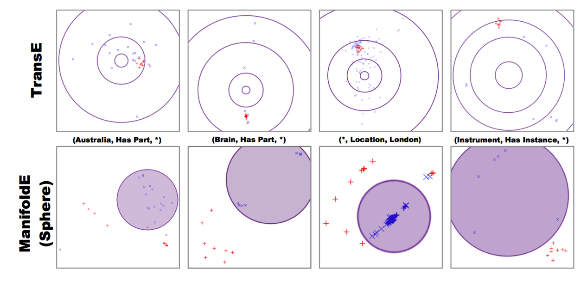

***越靠近圆心组成正确三元组的可能性越大，蓝色为正确的答案，红色为噪声，其中TransE的方法无法很好地区分，而本文提出的ManifoldE可以很好的区分噪声数据。***

通过将***golden triples的位置从一点扩展到一个流形(例如高维球体)***，ManifoldE缓解了这个问题。

优点：
- 我们已经解决了精确链接预测的问题，并将此问题归结于两个原因:不适定的代数系统和过于严格的几何形式。据我们所知，这是第一次正式处理这个问题。
- 我们提出了一个基于流形的原理来缓解这个问题，并设计了一个新的模型——**流形**，它在实验中比最先进的基线有了显著的改进，特别是在精确嵌入任务中。

打分函数：

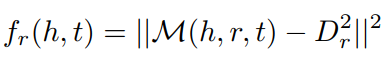

（1.） 假设M是一个球面，球面是一种非常典型的流形。

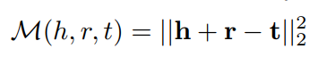

这里的向量可以应用Reproducing Kernel Hilbert Space (RKHS)映射到Hilbert空间，以更高效地表征流形。

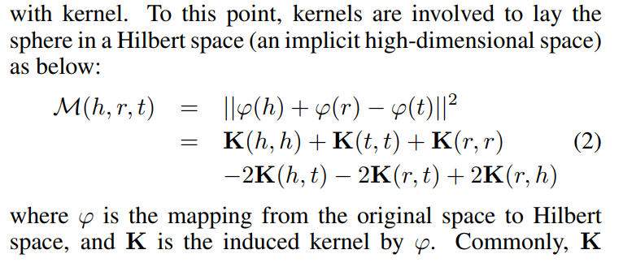

（2.） 超平面为流形

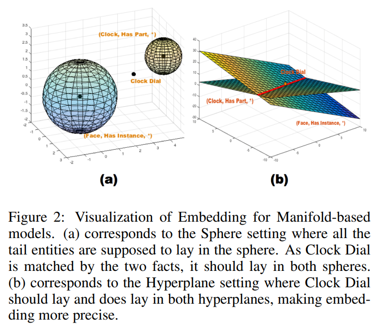

对于给定头实体和关系类型，尾实体位于以$ (h + r_{head})^T$为方向、偏移量与$D_r^2$相关的超平面上。在空间中，只要两个法向量不平行，这两个超平面就会有相交。

流形函数定义如下：

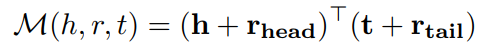

为了增加给定头实体和关系推理出精确的尾实体数量，对向量绝对值化：

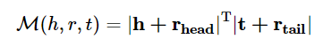

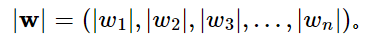

#### 1.3.12 TorusE(2018)

问题：
- TransE要求前件的向量表示h与关系的**向量表示$r$之和与后件的向量表示$t$越接近越好**。然而TransE的正则约束会迫使实体的向量表示在一个球面上，而这与之前的优化条件又是相互矛盾的。这种矛盾还会影响实体间连接预测的准确性。

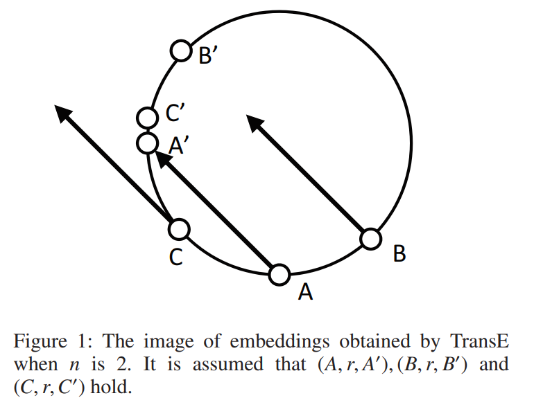
箭头方向表示关系$r$。

思想：
- TorusE拥有类似TransE遵循的优化目标和正则项。为了避免上述的正则项带来的矛盾，TorusE不再将特征学习到一个开流形（open manifold）的欧式空间，而是在***紧空间***（compact space）上学习知识图谱的嵌入表示。

可以证明，***紧李群***可以满足TransE遵循的优化目标和正则项条件，即嵌入空间为可微的流形空间，满足阿贝尔群性质，群运算可微且能够定义距离函数。证明了任意一个阿贝尔李群符合嵌入空间的需求后，作者构建了一个紧李群 $ T^n $的圆环空间和圆环空间上的不同范式的距离函数$ d_{L_1}, d_{L_2}, d_{L_3}$。

***圆环空间及距离函数***定义如下：

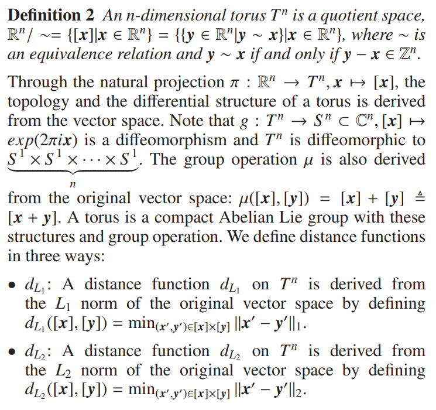

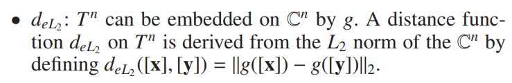

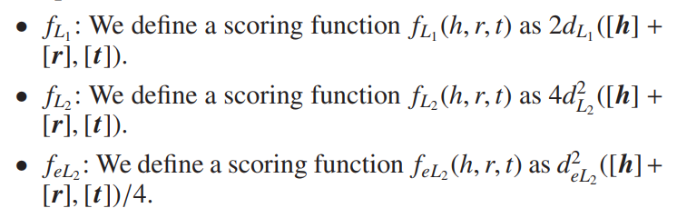

类似于TransE在 $R^n$上的优化目标 $ h + r = t $ ，TorusE在 $T^n$上构建 $ [h] + [r] = [t] $ ，并根据距离函数不同定义三个对应的评分函数

目标函数：

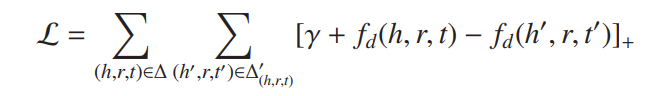

效果：
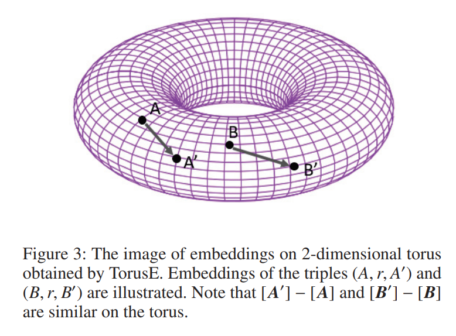
箭头方向表示关系$r$。

#### 1.3.13 DihEdral(2019)

链接预测对于不完全知识图谱(KG)在下游任务中的应用至关重要。作为链接预测的一组有效方法，嵌入方法尝试学习实体和关系的低秩表示，使其中定义的**双线性**形式是一个良好的评分函数。现有的双线性形式虽然表现良好，但忽视了关系成分的建模，**导致对KG推理缺乏可解释性。**
为了填补这一空白，我们提出了一种新的***二面体模型***，以二面体对称群命名。该模型学习知识图谱嵌入，能够自然地捕获关系组合。此外，我们的方法对离散值参数化的关系嵌入进行了建模，从而大大减小了求解空间。

DihEdral采用二面体群进行旋转，如下图所示，二面体群具有两种性质，即旋转和对称操作。DihEdral将多个二面体群组成对角矩阵，并定义评分函数为$ f_r(h,t) = ||R^Th-t||^2_2 $，其中R是二面体群组成的对角矩阵。同样，DihEdral能够从理论上解决对称/反对称、翻转、组合（Abelian, Non-Abelian）关系。

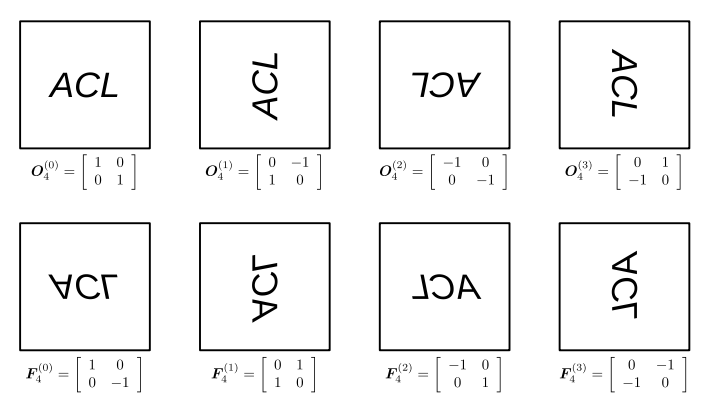

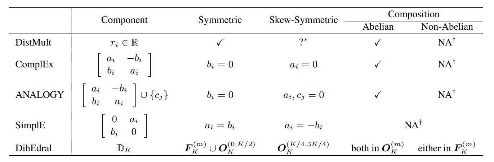

太难了就不扯了。

总结：

1. 关系的多样性，如1-1, 1-N, N-1, N-N关系，对称/反对称、翻转、组合等信息。如翻译、旋转模型。 2. 实体的层次性，实体之间的上下位关系。如双曲空间模型。 3. 实体和关系的深层次交互信息。如双线性和神经网络模型。

个人认为可深入研究的点包括图神经网络、欧式或双曲空间中实体的层次性问题、旋转模型解决关系多样性（群论角度）。同时，还需要重点关注负采样方法、损失函数、数据增强问题（比如（h, r, t）可扩展增加（t, r_inverse, h））

### 1.4 auxiliary information

## 2. KNOWLEDGE ACQUISITION

可以从3个方面来讨论：KGC用于扩展现有的知识图，relation extraction and entity discovery用于从文本中发现新知识(即关系和实体)。

KGC分为以下几类:基于嵌入的排序、关系路径推理、基于规则的推理和元关系学习。

实体发现包括识别、消歧、类型化和对齐。

关系提取模型利用注意机制、图卷积网络(GCN)、对抗训练、强化学习、深度剩余学习、转移学习。

## 3. Temporal Knowledge Graphs

时态知识图包含了表示学习的时态信息。下面对时间嵌入、实体动态、时间关系依赖、时间逻辑推理四个研究领域进行了分类。

## 4. Knowledge-aware Applications

知识感知应用程序包括自然语言理解(NLU)、问题回答、推荐系统和各种真实世界的任务，这些应用程序注入知识以改进表示学习。

