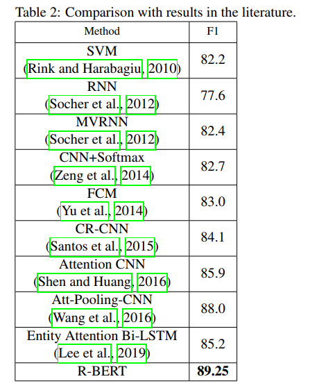

# 知识图谱之关系抽取模型演化之路


## Background

知识图谱技术是人工智能技术的重要组成部分，以结构化的方式描述客观世界中的概念、实体及其键的关系。知识图谱提技术提供了一种更好的组织、管理和理解互联网海量信息的能力，将互联网的信息表达成更接近于人类认知世界的形式。因此，建立一个具有语义处理能力与开放互联能力的知识库，可以在智能搜索、智能问答、个性化推荐等智能信息服务重产生应用价值。

将文本翻译成结构化数据是一直当前最知识图谱搭建最重要的环节，也是NLP中重要的课题。在这个任务中，关系抽取是核心部分。
怎样从不同来源的文本或对话中提取真实可用的“知识”，并保证这些“知识”通常是清楚的、合理的信息，是当今关系抽取的一个难点。


本文以关系抽取为出发点，从模型的角度进行分析。
最开始关系抽取是对数据进行分析总结得到先验知识，然后基于先验信息写出模板规则，最后采用匹配或推理的手段将模板规则应用于文本中提取出三元组信息。随着数据量的增加，这种方式也逐步被替代。随着神经网络模型在CV上取得重大突破，
人们也着手于文本上应用网络进行建模。从一个句子中抽取出三元组信息或者预测句子中两个实体之间的关系，我们会比较关心句子本身表达的含义（sentence representation, 类似于文本分类）和两个实体可以表现的特征（other features）。基于这个想法，2014年以来有很多研究学者在不同数据集上对此进行建模，下面我们分析4个模型。


##  1. Universal Language Model
### 1. CNN with Max Pooling and Lexical Features

在Relation Classification via Convolutional Deep Neural Network这片文章中使用了比较经典的CNN的结构，包含了Pooling层，以及设计了Position Features等特征。

模型框架如下：


- （1）Word Representation： 可以用预训练的词向量。
- （2）Feature Extraction: lexical level features and sentence level features.
- （3）将两种Feature 直接 concat 输入到一个全连接层+Softmax 来对关系做分类。

文章中提到的lexical features包括5个特征：
- L1: entity1
- L2: entity2
- L3: entity1的左右两个tokens
- L4: entity2的左右两个tokens
- L5: WordNet中两个entity的上位词


    例如：
        2019年<e1>新型冠状病毒</e1>最开始出现在<e2>武汉</e2>。
        L1: entity1：新型冠状病毒
        L2: entity2：武汉
        L3: entity1包含：年、最
        L4：entity2包含：在、。
        L5: 在wordNet中找到两个entity的上位词。上位词就是包含关系，比如“武汉”这个词的上位词就是“地名”。 这种包含关系其实类似于指明了实体的类型特征。


这5个特征都是lexical level的，之后在使用它们的word embedding串联起来作为最后的lexical feature.

我们再看一下该文的sentence level features，具体结构见下图：


- （1）WF(word feature)：预训练词向量。
- （2）PF(position feature)：位置特征， 每个word与两个entity的相对距离。
- （3）CNN+MaxPooling

在SemEval 2010 Task 8 Dataset的表现：


可以看出较以前的一些模型还是有一些提高。
加入不同特征之后的比较结果：


可以看出来，L5(word net)和PF两个特征比较关键。 Lexical中的两个实体的embedding 其实也属于对实体的强调，作用跟Position Feature 感觉有点类似，都是为了突出是对句子中的那两个词做关系分类，或者说都是为了强调距离目标实体越近，影响越大。PF的效果要比L1-L4好。

- 优点:
    - 使用Pooling 操作，提取了每一个卷积核对应的最优特征。
    - 引入Position Feature: 相当于在一定程度上引入了位置信息，因为CNN更多是局部N-Gram特征; PF突出了实体的影响。
- 缺点:
    - 虽然使用了多个卷积核，但是仅仅使用同一个window-size, 提取特征比较单一。
    - 结构还是相对简单，更多的是类似于CNN文本分类的结构。而且还是加入了人为构造的Lexical Feature。

### 2. CNN and Attention

随着注意力模型的兴起，2016年一些学者将attention应用于关系抽取任务中，通过attention学习其他特征提高效果。

关系抽取的重点是找到决定语义信息的关键词汇，引入attention使得模型从实体的角度出发去捕获相关的词汇。下面讨论Attention-Based Convolutional Neural Network for Semantic Relation Extraction中的模型，
该模型充分利用了词嵌入、词性标记嵌入和位置嵌入信息。将注意机制引入到卷积神经网络(CNN)中，
以提取对句子意义重要的单词，并将这些信息单词的表示集合起来形成一个句子向量。

词级注意机制能够更好地确定句子的哪一部分对两个兴趣实体影响最大。这种体系结构使我们能够从特定于任务的标记数据中学习一些重要的特性，从而避免了对外部知识(如显式依赖结构)的需求。

具体模型框架如图：


模型包括：Word Representation、Feature Extraction、Concatenation 和 Output 4个部分，其中特征提取是最重要的部分。
特征提取是主要的组成部分，它由句子卷积和基于注意的上下文选择两部分组成。
在特征提取后，生成了两类基于语义关系分类的向量：句子卷积向量和基于注意的上下文向量。

接下来重点看一下Feature Extraction:
- (1) Sentence Convolution
模型输入包括：Word Embeddings、Position Embeddings 和 Part-of-speech tag Embeddings（为了丰富词的特征表示，我们引入词性嵌入）。

具体框架如下图：


在关系提取中，一个主要的挑战是，句子的长度是可变的，重要的信息可以出现在任何地方。因此，我们应该合并所有局部特征并全局执行关系预测。这里，我们使用一个卷积层来合并所有这些特性。

使用一个卷积核大小为```l```进行滑动（在句子边界采用 0 向量做 padding），提取局部句子特征，然后通过最大池操作组合所有局部特征，为输入语句获得一个固定大小的向量。

句向量为：
```math
    \mathbf{c} = max\{ [c_1, c_2, ..., c_{n-h+1} ] \}
```
其中：```$ c_i = f(w\cdot x_{i:i+h-1}) $```


- (2) Attention-based Context Selection

注意力模型被应用于一个相当不同的场景，它由不同的对象组成，即一个句子和两个实体。因此，该文试图赋予模型一种能力，来确定句子的哪些部分对于两个相关实体最具影响力。

具体框架如下图：


attention之后得到的向量为：
```math
    s_{ij} = \sum_{t}\frac{exp(u_{it}^j)}{\sum_texp(u_{it}^j)}\cdot w_{it}
```
其中：```$ h_{it}^j = [w_{it}, e_{ij}]$```, ```$ u_{it}^j = W_a[tanh(W_{we}h_{it}^j + b_{we})] + b_a $```


这里是将每个实体都和句子中的每一个字来做attention，目的找到句子中与实体相似度的高的词。


最后，我们可以得到三个网络的输出，其中包括卷积网络的结果，以及两个实体的句子上下文向量。然后我们将所有三个输出向量连接成一个固定长度的特征向量。这个向量喂给MLP。
更具体地说，首先将得到的向量输入到一个完整的连接隐层中，以获得更抽象的表示，然后将这个抽象表示连接到输出层。最后输出是不同类的概率，由全连通层后的softmax函数计算。


在SemEval 2010 Task 8 Dataset的表现：


从结果中发现加入attention之后比上一个模型提升了3个点，说明attention在抓起句子中关键词信息中起作用了。

- 优点：
    - 引入attention模型，利用实体信息去抓取句子中关键词信息
    - 充分利用词嵌入、位置嵌入、词性嵌入来编码句子信息

- 缺点：
    - 加入了人为构造的Lexical Feature
    - 使用一个卷积获取局部特征相对较少


### 3. BLSTM-CCAtt model

英语和汉语的一个显著区别是汉字。在中文中，还有另一种方式来提供有关实体的信息。英语和汉语的一个显著区别是汉字。英语只有26个字母。它们大多没有特定的含义。汉字有成千上万的常用汉字，其中很多都有明确的含义。基于这种差异，我们建议可以获取实体的信息，如类型、颜色和位置。来自构成实体的字符。

除了句子中包含的信息外，关于实体的附加信息也被验证为有助于关系提取。由NER获取的实体类型(命名实体识别)和知识库提供的描述等附加信息都有其局限性。然而，在汉语关系抽取中，还有另一种提供附加信息的方法可以克服这些局限性。

下面我们讨论An Attention-Based Model Using Character Composition of Entities in Chinese Relation Extraction中的模型，
该文首先基于中文百科全书生成一个大规模的中文关系抽取数据集。其次，提出了一个基于字符组合的双向lstm模型注意力模型，该模型使用组成实体的字符。对生成的数据集的结果表明，这些字符可以为汉语关系提取任务提供有用的信息。通过使用这些信息，我们使用的注意机制可以识别出能够表达这种关系的句子的关键部分。

模型具体结构如下图：


- (1) Embedding:
    - 字向量：```$\mathbf{r}_i = [\mathbf{v}_i: \mathbf{p}_i^h: \mathbf{p}_i^t]$```，包括词向量和位置向量
    - 句向量：```$ R = \{\mathbf{r}_1, \mathbf{r}_2, ..., \mathbf{r}_n\} $```

- (2) Encoders

采用双向BiLSTM对句子和实体进行编码
```math
    \mathbf{H}_s = BILSTM\{\mathbf{r}_1, \mathbf{r}_2, ..., \mathbf{r}_n\}
```
```math
    \mathbf{H}_e = BILSTM\{\mathbf{e}_1, \mathbf{e}_2, ..., \mathbf{e}_n\}
```

最后采用隐藏状态的average pooling结果作为实体的特征表示： ```$\mathbf{r}_e$``` 。

- (3) Attention

它的目的是选择与给定查询最相关的部分。

最后的句子特征表示：
```math
    \mathbf{r}_s = softmax(\mathbf{q} \mathbf{W} \mathbf{H}_s) \mathbf{H}_s
```
其中：```$\mathbf{q} = \mathbf{r}_e^h - \mathbf{r}_e^t$``` 


为了强调实体信息，我们将句子和实体表示联系起来作为实例表示:
```math
    \mathbf{r} = [\mathbf{r}_s : \mathbf{r}_e]
```
其中：
```math
    \mathbf{r}_e = [\mathbf{r}_e^h : \mathbf{r}_e^t]
```

- (4) Multi-Instance Learning

远程学习极大地降低了获取标记数据的成本，并使生成大规模数据集成为可能。然而，它并不完美。主要的不足是错误的标签问题。为了解决这一问题，将多实例学习引入到关系抽取任务中。多实例学习网络的输入不是一个句子，而是一个袋子。

有m个bags```$\{B_1, B_2, ..., B_m\}$```, 第k个bag包含n个实例（相同实体对）：```$ B_k = \{S_1, S_2, ..., S_n\}$```

bag的特征表示：

```math
    \mathbf{x} = \beta_s \mathbf{R}
```
其中：```$ \mathbf{R} = \{\mathbf{r}_1, \mathbf{r}_2, ..., \mathbf{r}_n\}$```, ```$ \beta_s = softmax(\mathbf{R}\mathbf{W}_s\mathbf{l})$```, ```$\mathbf{l}$```是关系特征。


bag的预测概率：
```math
    \mathbf{p} = softmax(\mathbf{L}\mathbf{x} + \mathbf{d})
```
其中：```$\mathbf{L}$```是关系表示的矩阵。


在百科数据集中不同模型的表现：


可以看出在百度数据集上表现不错，F1指标有87.3%.

在30种关系的具体表现为：


- 优点：
    - 采用字符级的BLSTM编码，有效提取汉字字符信息
    - 实体和句子attention模型抓取句子中重要的字信息

- 缺点：
    - 双向LSTM对句子直接拼接生成的句向量不是最佳方案
    - Attention等虽然能够抓取关键信息，但是对于关键词的位置信息支持效果不佳，尤其是短文本


## 2. Pre-training Language Model
### 1. RBERT model

随着bert的提出，nlp基本任务在bert的助力下都得到很大的提升，这里我们讨论一下将bert应用于关系抽取的RBERT模型。

该模型中，利用预先训练的BERT语言模型并结合目标实体的信息来处理关系分类任务的模型。模型定位目标实体并通过预先训练的体系结构传输信息，并将两个实体的相应编码合并在一起。

具体模型结构如下：


采用两个特殊字符（$, #）分别修饰两个实体。

从bert中提取三个向量，[CLS] token, averaged entity_1, averaged entity_2。然后对每个向量都进行dropout,全连接层，激活层。最后拼接着三个向量，用softmax进行分类预测。


其中： ```$ W_1 = W_2 $```, ```$ b_1 = b_2 $```


在SemEval 2010 Task 8 Dataset的表现：



从以上几个模型可以看出RBert远高于其他模型，体现了bert强大的字符表征能力。模型中引入特征字符目的是为了突出实体特征，这个想法也吻合我们最初的想法。

我们将RBERT模型应用我们的任务中，也取得了很好的表现。
在我们自己的实验中，我们对19种关系进行分类实验，训练数据和测试数据评估结果如下：
- 训练数据：

    
    
- 评估结果：


数据分布属于一种长尾分布，与现实工业中的所产生的数据分布相似。除了数据分布较少的关系和有关系中实体有歧义预测效果不好，其他关系预测效果表现都很好。


- 优点：
    - 采用bert预训练模型，在获取字符表示上有不错效果
    - 引入特殊字符有效的突出实体信息
    - 引入外部信息，提高泛化性
    
- 缺点：
    - bert等训练、推理速度慢，占用资源多
    - bert等训练微调时与推理的输入不一致，且对超长文本不友好
    - bert等对于相同、相近句式语义区分不够明显


## Text Classification 
除了上述的思路之外，把关系抽取单纯的看成是文本分类的方式也是一种比较流行的方法。下面通过2个模型来看这类方法的演化。

### 1. BiLstm+Attention Model


### 2. MG lattice framework


## Conclusion

知识图谱的构建是一个大工程，关系抽取又是这个大工程中的核心组成部分，在当前行业数据之间差异性、数据分布不均性的情况下，要做好这项任务是极具挑战的。我们可以从模型
可解释性的方向入手来优化和建模，可以找寻“通用特征”（例如：常用知识库）来丰富Other features。当然我们还可以有其他思路的建模，例如BiLstm+Attention模型。
接下来我们会讨论其他思路的建模，更深入的解析关系抽取任务。


## References

1. Relation Classification via Convolutional Deep Neural Network
2. Attention-Based Convolutional Neural Network for Semantic Relation Extraction
3. An Attention-Based Model Using Character Composition of Entities in Chinese Relation Extraction
4. Enriching Pre-trained Language Model with Entity Information for Relation Classification
5. Attention-Based Bidirectional Long Short-Term Memory Networks for Relation Classification

