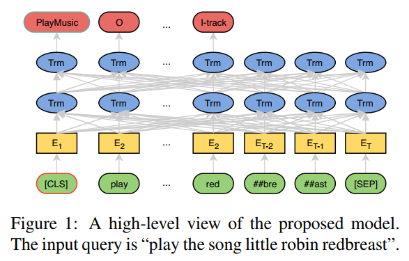

# slot and intent

## data

### atis

数据特点：长尾分布，意图和槽位混合分布

样本个数：train：4478, test：893, dev:500.

样本长度：最长46，最短1，平均12

槽位和意图情况：

意图(21类)：

[atis_abbreviation, atis_aircraft, atis_aircraft#atis_flight#atis_flight_no, atis_airfare， atis_airline， 
atis_airline#atis_flight_no, atis_airport， atis_capacity, atis_cheapest， atis_city,  atis_distance， atis_flight,  
atis_flight#atis_airfare， atis_flight_no， atis_flight_time, atis_ground_fare， atis_ground_service, 
atis_ground_service#atis_ground_fare， atis_meal, atis_quantity， atis_restriction]

槽位(83类):

{
'atis_flight': ['aircraft_code', 'airline_code', 'airline_name', 'airport_code', 'airport_name', 'arrive_date.date_relative', 
                'arrive_date.day_name', 'arrive_date.day_number', 'arrive_date.month_name', 'arrive_date.today_relative', 'arrive_time.end_time', 
                'arrive_time.period_mod', 'arrive_time.period_of_day', 'arrive_time.start_time', 'arrive_time.time', 'arrive_time.time_relative', 
                'city_name', 'class_type', 'compartment', 'connect', 'cost_relative', 'day_name', 'depart_date.date_relative', 'depart_date.day_name', 
                'depart_date.day_number', 'depart_date.month_name', 'depart_date.today_relative', 'depart_date.year', 'depart_time.end_time', 
                'depart_time.period_mod', 'depart_time.period_of_day', 'depart_time.start_time', 'depart_time.time', 'depart_time.time_relative', 
                'economy', 'fare_amount', 'fare_basis_code', 'flight', 'flight_days', 'flight_mod', 'flight_number', 'flight_stop', 'flight_time', 
                'fromloc.airport_code', 'fromloc.airport_name', 'fromloc.city_name', 'fromloc.state_code', 'fromloc.state_name', 'meal', 
                'meal_description', 'mod', 'or', 'period_of_day', 'return_date.date_relative', 'return_date.day_name', 'return_date.day_number', 
                'return_date.month_name', 'return_date.today_relative', 'return_time.period_mod', 'return_time.period_of_day', 'round_trip', 
                'stoploc.airport_code', 'stoploc.airport_name', 'stoploc.city_name', 'stoploc.state_code', 'toloc.airport_code', 'toloc.airport_name', 
                'toloc.city_name', 'toloc.country_name', 'toloc.state_code', 'toloc.state_name'], 
'atis_airfare': ['aircraft_code', 'airline_code', 'airline_name', 'arrive_date.date_relative', 
                'arrive_date.day_name', 'arrive_date.day_number', 'arrive_date.month_name', 'arrive_time.time', 'arrive_time.time_relative', 
                'class_type', 'connect', 'cost_relative', 'depart_date.date_relative', 'depart_date.day_name', 'depart_date.day_number', 
                'depart_date.month_name', 'depart_date.today_relative', 'depart_date.year', 'depart_time.period_mod', 'depart_time.period_of_day', 
                'depart_time.time', 'depart_time.time_relative', 'economy', 'fare_amount', 'flight_days', 'flight_mod', 'flight_number', 'flight_stop', 
                'flight_time', 'fromloc.airport_code', 'fromloc.airport_name', 'fromloc.city_name', 'fromloc.state_code', 'fromloc.state_name', 
                'meal', 'or', 'return_date.day_number', 'return_date.month_name', 'round_trip', 'stoploc.city_name', 'toloc.airport_code', 
                'toloc.airport_name', 'toloc.city_name', 'toloc.state_code', 'toloc.state_name'], 
'atis_airline': ['aircraft_code', 'airline_code', 'airline_name', 'airport_name', 'arrive_date.day_number', 'arrive_date.month_name', 
                'arrive_time.period_of_day', 'arrive_time.time', 'city_name', 'class_type', 'connect', 'cost_relative', 'depart_date.date_relative', 
                'depart_date.day_name', 'depart_date.day_number', 'depart_date.month_name', 'depart_date.today_relative', 'depart_time.end_time', 
                'depart_time.period_of_day', 'depart_time.start_time', 'depart_time.time', 'depart_time.time_relative', 'flight_days', 'flight_number', 
                'flight_stop', 'fromloc.airport_code', 'fromloc.airport_name', 'fromloc.city_name', 'fromloc.state_code', 'mod', 'round_trip', 
                'stoploc.city_name', 'toloc.airport_name', 'toloc.city_name', 'toloc.state_code', 'toloc.state_name'], 
'atis_ground_service': ['airport_code', 'airport_name', 'city_name', 'day_name', 'day_number', 'depart_date.date_relative', 
                'depart_date.day_name', 'depart_date.day_number', 'depart_date.month_name', 'flight_time', 'fromloc.airport_name', 'fromloc.city_name', 
                'month_name', 'or', 'period_of_day', 'state_code', 'state_name', 'time', 'time_relative', 'today_relative', 'toloc.airport_name', 
                'toloc.city_name', 'transport_type'], 
'atis_quantity': ['aircraft_code', 'airline_code', 'airline_name', 'arrive_date.day_number', 'arrive_date.month_name', 
                'arrive_time.time', 'arrive_time.time_relative', 'city_name', 'class_type', 'depart_date.day_number', 'depart_date.month_name', 
                'depart_date.today_relative', 'depart_time.period_of_day', 'depart_time.time', 'depart_time.time_relative', 'economy', 'fare_basis_code', 
                'flight_days', 'flight_number', 'flight_stop', 'fromloc.city_name', 'round_trip', 'stoploc.city_name', 'toloc.airport_name', 
                'toloc.city_name'], 
'atis_city': ['airline_name', 'airport_code', 'airport_name', 'city_name', 'class_type', 'depart_time.period_of_day', 
                'depart_time.time', 'depart_time.time_relative', 'fromloc.airport_code', 'fromloc.city_name', 'toloc.city_name'], 
'atis_flight#atis_airfare': ['airline_name', 'arrive_time.time', 'arrive_time.time_relative', 'cost_relative', 'depart_date.date_relative', 
                'depart_date.day_name', 'depart_date.day_number', 'depart_date.month_name', 'depart_time.period_of_day', 'depart_time.time', 
                'depart_time.time_relative', 'fare_amount', 'flight_mod', 'flight_number', 'flight_stop', 'fromloc.city_name', 'return_date.date_relative', 
                'return_date.day_name', 'round_trip', 'toloc.city_name', 'toloc.state_code'], 
'atis_abbreviation': ['aircraft_code', 'airline_code', 'airline_name', 'airport_code', 'booking_class', 'class_type', 'days_code', 
                'fare_basis_code', 'fromloc.city_name', 'meal', 'meal_code', 'mod', 'restriction_code', 'toloc.city_name'], 
'atis_aircraft': ['aircraft_code', 'airline_code', 'airline_name', 'arrive_date.day_name', 'arrive_date.day_number', 
                'arrive_date.month_name', 'arrive_time.time', 'arrive_time.time_relative', 'city_name', 'class_type', 'depart_date.day_name', 
                'depart_date.day_number', 'depart_date.month_name', 'depart_time.period_of_day', 'depart_time.time', 'depart_time.time_relative', 
                'flight_mod', 'flight_number', 'fromloc.city_name', 'mod', 'stoploc.city_name', 'toloc.city_name', 'toloc.state_code'], 
'atis_distance': ['airport_name', 'city_name', 'depart_date.day_number', 'depart_date.month_name', 'depart_time.time', 
                'fromloc.airport_name', 'fromloc.city_name', 'toloc.city_name'], 
'atis_ground_fare': ['airport_name', 'city_name', 'fromloc.airport_name', 'fromloc.city_name', 'toloc.city_name', 'transport_type'], 
'atis_capacity': ['aircraft_code', 'airline_name', 'fromloc.city_name', 'mod', 'toloc.city_name'], 
'atis_flight_time': ['aircraft_code', 'airline_code', 'airline_name', 'airport_name', 'class_type', 'depart_date.date_relative', 
                'depart_date.day_name', 'depart_date.day_number', 'depart_date.month_name', 'depart_time.period_of_day', 'depart_time.time', 
                'depart_time.time_relative', 'flight_mod', 'flight_number', 'flight_time', 'fromloc.airport_name', 'fromloc.city_name', 'meal_description', 
                'toloc.airport_code', 'toloc.city_name'], 
'atis_meal': ['airline_code', 'airline_name', 'arrive_time.time', 'depart_date.day_name', 'depart_time.period_of_day', 'flight_number', 
                'fromloc.city_name', 'meal', 'meal_description', 'toloc.airport_code', 'toloc.city_name', 'toloc.state_code'], 
'atis_aircraft#atis_flight#atis_flight_no': ['airline_name', 'depart_time.time', 'depart_time.time_relative', 'fromloc.city_name', 
                'toloc.city_name'], 
'atis_flight_no': ['airline_name', 'arrive_time.time', 'arrive_time.time_relative', 'class_type', 'cost_relative', 'depart_date.day_name', 
                'depart_date.day_number', 'depart_date.month_name', 'depart_date.today_relative', 'depart_time.period_of_day', 'depart_time.time', 
                'depart_time.time_relative', 'flight_mod', 'flight_number', 'flight_time', 'fromloc.city_name', 'fromloc.state_name', 'or', 
                'stoploc.city_name', 'toloc.city_name', 'toloc.state_code', 'toloc.state_name'], 
'atis_restriction': ['cost_relative', 'fare_amount', 'fromloc.city_name', 'restriction_code', 'round_trip', 'toloc.city_name'], 
'atis_airport': ['airline_name', 'airport_name', 'city_name', 'flight_stop', 'fromloc.city_name', 'mod', 'state_code', 'state_name', 
                'toloc.city_name'], 
'atis_airline#atis_flight_no': ['arrive_time.time', 'arrive_time.time_relative', 'depart_date.date_relative', 'depart_date.day_number', 
                'depart_date.month_name', 'fromloc.city_name', 'toloc.city_name'], 
'atis_cheapest': ['cost_relative'], 
'atis_ground_service#atis_ground_fare': ['fromloc.airport_name'], 
'atis_airfare#atis_flight_time': ['flight_time', 'fromloc.city_name', 'toloc.city_name'], 
'atis_day_name': ['fromloc.city_name', 'toloc.city_name'], 
'atis_airfare#atis_flight': ['airline_name', 'flight_number', 'fromloc.airport_code', 'toloc.airport_code'], 
'atis_flight#atis_airline': ['depart_date.day_name', 'depart_time.time', 'depart_time.time_relative', 'fromloc.city_name', 
                'toloc.city_name'], 
'atis_flight_no#atis_airline': ['depart_date.day_name', 'depart_time.time', 'depart_time.time_relative', 'fromloc.city_name', 
                'toloc.city_name']}

train: 

    意图情况 (21)：
    {'atis_flight': 3309, 'atis_airfare': 385, 'atis_airline': 139, 'atis_ground_service': 230, 'atis_quantity': 41, 
    'atis_city': 18, 'atis_flight#atis_airfare': 19, 'atis_abbreviation': 130, 'atis_aircraft': 70, 'atis_distance': 17, 
    'atis_ground_fare': 15, 'atis_capacity': 15, 'atis_flight_time': 45, 'atis_meal': 6, 'atis_aircraft#atis_flight#atis_flight_no': 1, 
    'atis_flight_no': 12, 'atis_restriction': 5, 'atis_airport': 17, 'atis_airline#atis_flight_no': 2, 'atis_cheapest': 1, 
    'atis_ground_service#atis_ground_fare': 1}
    
    槽位情况 (79)：
    {'fromloc.city_name': 3892, 'toloc.city_name': 3919, 'round_trip': 323, 'cost_relative': 311, 'fare_amount': 46, 
    'arrive_date.month_name': 43, 'arrive_date.day_number': 43, 'stoploc.city_name': 218, 'arrive_time.time_relative': 173, 
    'arrive_time.time': 191, 'toloc.state_code': 76, 'meal_description': 49, 'depart_date.month_name': 339, 
    'depart_date.day_number': 355, 'airline_name': 639, 'depart_time.period_of_day': 521, 'depart_date.day_name': 785, 
    'toloc.state_name': 70, 'depart_time.time_relative': 283, 'depart_time.time': 327, 'toloc.airport_name': 35, 
    'depart_date.date_relative': 76, 'or': 59, 'airline_code': 127, 'class_type': 194, 'fromloc.airport_name': 73, 
    'city_name': 204, 'flight_mod': 289, 'meal': 43, 'economy': 34, 'fare_basis_code': 63, 'depart_date.today_relative': 75, 
    'flight_stop': 143, 'airport_code': 25, 'fromloc.state_name': 35, 'connect': 36, 'arrive_date.day_name': 78, 
    'fromloc.state_code': 41, 'arrive_date.today_relative': 1, 'depart_date.year': 21, 'depart_time.start_time': 24, 
    'depart_time.end_time': 24, 'arrive_time.start_time': 18, 'arrive_time.end_time': 17, 'flight_days': 37, 'mod': 29, 
    'flight_number': 78, 'meal_code': 6, 'airport_name': 34, 'transport_type': 40, 'state_code': 7, 'aircraft_code': 30, 
    'toloc.country_name': 3, 'toloc.airport_code': 16, 'return_date.date_relative': 7, 'flight_time': 59, 
    'fromloc.airport_code': 14, 'arrive_time.period_of_day': 51, 'depart_time.period_mod': 35, 'return_date.day_name': 1, 
    'arrive_date.date_relative': 9, 'restriction_code': 21, 'arrive_time.period_mod': 3, 'period_of_day': 3, 
    'stoploc.state_code': 5, 'time': 2, 'today_relative': 2, 'state_name': 1, 'days_code': 2, 'time_relative': 1, 
    'return_date.month_name': 2, 'return_date.day_number': 2, 'stoploc.airport_name': 1, 'day_name': 3, 'month_name': 2, 
    'day_number': 2, 'return_time.period_mod': 2, 'return_time.period_of_day': 2, 'return_date.today_relative': 1}

dev: 

    意图情况 (16)：
    {'atis_flight': 357, 'atis_airfare': 38, 'atis_restriction': 1, 'atis_ground_service': 25, 'atis_abbreviation': 17, 
    'atis_aircraft': 11, 'atis_airline': 18, 'atis_quantity': 10, 'atis_flight_time': 9, 'atis_distance': 3, 
    'atis_flight#atis_airfare': 2, 'atis_ground_fare': 3, 'atis_capacity': 1, 'atis_city': 1, 'atis_airport': 3, 
    'atis_airfare#atis_flight_time': 1}
    
    槽位情况 (67)：
    {'fromloc.city_name': 434, 'depart_time.time': 42, 'toloc.city_name': 424, 'arrive_time.time': 17, 
    'arrive_time.period_of_day': 13, 'round_trip': 25, 'airline_name': 62, 'class_type': 23, 'depart_date.month_name': 40, 
    'depart_date.day_number': 40, 'return_date.month_name': 2, 'return_date.day_number': 2, 'flight_mod': 40, 
    'meal_description': 8, 'depart_time.start_time': 1, 'depart_time.end_time': 1, 'toloc.state_name': 7, 
    'depart_time.period_of_day': 72, 'cost_relative': 33, 'toloc.state_code': 10, 'toloc.airport_name': 4, 
    'depart_time.time_relative': 40, 'return_time.period_of_day': 1, 'stoploc.city_name': 21, 'restriction_code': 2, 
    'city_name': 23, 'airline_code': 9, 'depart_date.date_relative': 6, 'depart_date.day_name': 104, 'flight_stop': 25, 
    'arrive_time.time_relative': 14, 'fromloc.airport_name': 16, 'flight_time': 12, 'day_name': 2, 'period_of_day': 2, 
    'return_date.date_relative': 3, 'arrive_date.month_name': 4, 'arrive_date.day_number': 4, 'fare_amount': 7, 
    'arrive_date.today_relative': 1, 'transport_type': 8, 'depart_date.year': 4, 'aircraft_code': 1, 'depart_time.period_mod': 9, 
    'depart_date.today_relative': 9, 'arrive_time.start_time': 3, 'arrive_time.end_time': 3, 'arrive_date.day_name': 10, 
    'arrive_time.period_mod': 1, 'airport_code': 4, 'or': 7, 'fromloc.state_code': 5, 'fare_basis_code': 13, 'toloc.airport_code': 4, 
    'flight_number': 6, 'meal': 3, 'connect': 4, 'fromloc.state_name': 4, 'flight_days': 2, 'airport_name': 4, 
    'fromloc.airport_code': 1, 'arrive_date.date_relative': 2, 'economy': 2, 'days_code': 1, 'state_code': 1, 'state_name': 1, 'mod': 1}

test: 

    意图情况 (20)：
    {'atis_flight': 632, 'atis_airfare': 48, 'atis_flight#atis_airfare': 12, 'atis_ground_service': 36, 'atis_day_name': 2, 
    'atis_meal': 6, 'atis_airport': 18, 'atis_airline': 38, 'atis_flight_time': 1, 'atis_city': 6, 'atis_ground_fare': 7, 
    'atis_quantity': 3, 'atis_abbreviation': 33, 'atis_distance': 10, 'atis_aircraft': 9, 'atis_airfare#atis_flight': 1, 
    'atis_capacity': 21, 'atis_flight#atis_airline': 1, 'atis_flight_no#atis_airline': 1, 'atis_flight_no': 8}
    
    槽位情况 (69)：
    {'fromloc.city_name': 704, 'toloc.city_name': 716, 'stoploc.city_name': 20, 'depart_date.month_name': 56, 
    'depart_date.day_number': 55, 'depart_time.time_relative': 65, 'depart_time.time': 57, 'round_trip': 73, 
    'airline_name': 101, 'depart_date.day_name': 212, 'depart_time.period_of_day': 130, 'meal_description': 10, 
    'depart_date.date_relative': 17, 'arrive_time.time_relative': 31, 'arrive_time.time': 34, 'return_date.day_name': 2, 
    'arrive_date.date_relative': 2, 'arrive_date.day_name': 11, 'flight_stop': 21, 'depart_date.today_relative': 9, 
    'toloc.state_name': 28, 'arrive_date.month_name': 6, 'arrive_date.day_number': 6, 'arrive_time.start_time': 8, 
    'arrive_time.end_time': 8, 'airport_name': 21, 'connect': 6, 'fromloc.airport_name': 12, 'meal': 16, 'flight_number': 11, 
    'return_date.date_relative': 3, 'arrive_time.period_of_day': 6, 'fromloc.state_name': 17, 'city_name': 57, 
    'cost_relative': 37, 'flight_time': 1, 'flight_mod': 24, 'class_type': 24, 'airline_code': 34, 'toloc.airport_code': 4, 
    'transport_type': 10, 'depart_time.start_time': 3, 'depart_time.end_time': 3, 'toloc.airport_name': 3, 'aircraft_code': 33, 
    'toloc.country_name': 1, 'mod': 2, 'state_name': 9, 'compartment': 1, 'meal_code': 1, 'day_name': 2, 'toloc.state_code': 18, 
    'fromloc.state_code': 23, 'depart_time.period_mod': 5, 'fromloc.airport_code': 5, 'fare_basis_code': 17, 'flight_days': 10, 
    'depart_date.year': 3, 'period_of_day': 4, 'state_code': 1, 'restriction_code': 4, 'airport_code': 9, 'days_code': 1, 
    'or': 3, 'stoploc.airport_code': 1, 'economy': 6, 'booking_class': 1, 'fare_amount': 2, 'flight': 1}

### snips

数据特点：长尾分布，意图和槽位混合分布

样本个数：train：13084, test：700, dev:700.

样本长度：最长35，最短2，平均9

槽位和意图情况：

意图(7类)：

[AddToPlaylist, BookRestaurant, GetWeather， PlayMusic, RateBook， SearchCreativeWork, SearchScreeningEvent]

槽位(39类):

{'PlayMusic': ['album', 'artist', 'genre', 'music_item', 'playlist', 'service', 'sort', 'track', 'year'], 
'AddToPlaylist': ['artist', 'entity_name', 'music_item', 'playlist', 'playlist_owner'], 
'RateBook': ['best_rating', 'object_name', 'object_part_of_series_type', 'object_select', 'object_type', 'rating_unit', 'rating_value'], 
'SearchScreeningEvent': ['location_name', 'movie_name', 'movie_type', 'object_location_type', 'object_type', 'spatial_relation', 'timeRange'], 
'BookRestaurant': ['city', 'country', 'cuisine', 'facility', 'party_size_description', 'party_size_number', 'poi', 'restaurant_name', 
            'restaurant_type', 'served_dish', 'sort', 'spatial_relation', 'state', 'timeRange'], 
'GetWeather': ['city', 'condition_description', 'condition_temperature', 'country', 'current_location', 'geographic_poi', 
            'spatial_relation', 'state', 'timeRange'], 
'SearchCreativeWork': ['object_name', 'object_type']}

train: 

    意图情况 (7)：
    {'PlayMusic': 1914, 'AddToPlaylist': 1818, 'RateBook': 1876, 'SearchScreeningEvent': 1852, 'BookRestaurant': 1881, 
    'GetWeather': 1896, 'SearchCreativeWork': 1847}
    
    槽位情况 (39)：
    {'artist': 1804, 'album': 167, 'service': 738, 'entity_name': 561, 'playlist': 1963, 'object_select': 942, 
    'object_type': 3023, 'rating_value': 1877, 'best_rating': 1007, 'music_item': 1577, 'track': 202, 'playlist_owner': 1043, 
    'year': 611, 'sort': 518, 'movie_name': 765, 'party_size_number': 975, 'state': 953, 'city': 1304, 'timeRange': 1879, 
    'object_part_of_series_type': 298, 'movie_type': 666, 'spatial_relation': 1153, 'geographic_poi': 280, 'restaurant_type': 1299, 
    'party_size_description': 307, 'object_location_type': 450, 'object_name': 2789, 'rating_unit': 1081, 'location_name': 566, 
    'current_location': 259, 'served_dish': 258, 'country': 812, 'condition_temperature': 453, 'poi': 135, 'condition_description': 426, 
    'genre': 139, 'restaurant_name': 324, 'cuisine': 197, 'facility': 157}

dev: 

    意图情况 (7)：
    {'AddToPlaylist': 100, 'BookRestaurant': 100, 'GetWeather': 100, 'PlayMusic': 100, 'RateBook': 100, 
    'SearchCreativeWork': 100, 'SearchScreeningEvent': 100}
    
    槽位情况 (39)：
    {'music_item': 86, 'playlist_owner': 54, 'playlist': 109, 'entity_name': 18, 'artist': 109, 'party_size_description': 13, 
    'restaurant_type': 62, 'spatial_relation': 68, 'state': 51, 'country': 44, 'party_size_number': 57, 'cuisine': 11, 'city': 71, 
    'poi': 6, 'served_dish': 5, 'timeRange': 110, 'restaurant_name': 20, 'sort': 26, 'facility': 7, 'current_location': 17, 
    'condition_description': 22, 'geographic_poi': 16, 'condition_temperature': 21, 'album': 13, 'service': 39, 'year': 25, 
    'track': 6, 'genre': 3, 'object_select': 49, 'object_type': 156, 'rating_value': 100, 'best_rating': 51, 'rating_unit': 61, 
    'object_name': 151, 'object_part_of_series_type': 15, 'movie_name': 49, 'object_location_type': 20, 'location_name': 29, 
    'movie_type': 24}

test: 

    意图情况 (7)：
    {'AddToPlaylist': 124, 'BookRestaurant': 92, 'GetWeather': 104, 'PlayMusic': 86, 'SearchScreeningEvent': 107, 
    'SearchCreativeWork': 107, 'RateBook': 80}
    
    槽位情况 (39)：
    {'artist': 107, 'playlist': 129, 'party_size_number': 50, 'spatial_relation': 71, 'poi': 8, 'restaurant_type': 65, 
    'playlist_owner': 70, 'condition_description': 28, 'state': 59, 'timeRange': 107, 'music_item': 104, 'sort': 32, 'movie_type': 33, 
    'country': 44, 'current_location': 14, 'movie_name': 47, 'object_location_type': 22, 'location_name': 24, 'object_type': 162, 
    'object_name': 147, 'served_dish': 12, 'object_select': 40, 'rating_value': 80, 'best_rating': 43, 'rating_unit': 40, 'city': 60, 
    'cuisine': 14, 'year': 24, 'entity_name': 33, 'service': 24, 'geographic_poi': 11, 'object_part_of_series_type': 11, 
    'condition_temperature': 23, 'restaurant_name': 15, 'party_size_description': 10, 'genre': 5, 'track': 9, 'album': 10, 'facility': 3}

### other

数据特点：长尾分布，意图和槽位混合分布

样本个数：train：2063, test：516, dev:516.

样本长度：最长27，最短2，平均9

槽位和意图情况：

意图(23类)：
[CLOSEPRICE_QUERY, CREATE, DEFAULT, DIAL, DOWNLOAD, FORWARD, LAUNCH, LOOK_BACK, NUMBER_QUERY, NaN, OPEN, PLAY, POSITION, 
QUERY, REPLAY_ALL, REPLY, RISERATE_QUERY, ROUTE, SEARCH, SEND, SENDCONTACTS, TRANSLATION, VIEW]

槽位(62类):
{
'ROUTE': ['endLoc_area', 'endLoc_city', 'endLoc_poi', 'endLoc_province', 'startLoc_area', 'startLoc_city', 'startLoc_poi', 'type'], 
'QUERY': ['Dest', 'Src', 'area', 'artist', 'artistRole', 'author', 'awayName', 'category', 'code', 'date', 'datetime_date', 
        'datetime_time', 'decade', 'dishName', 'dishNamet', 'dynasty', 'endLoc_area', 'endLoc_city', 'endLoc_poi', 'endLoc_province', 
        'episode', 'film', 'homeName', 'ingredient', 'keyword', 'location_city', 'name', 'payment', 'popularity', 'queryField', 
        'questionWord', 'resolution', 'scoreDescr', 'season', 'startDate_date', 'startDate_dateOrig', 'startDate_time', 'startLoc_area', 
        'startLoc_city', 'startLoc_poi', 'startLoc_province', 'subfocus', 'tag', 'theatre', 'timeDescr', 'tvchannel', 'type', 'utensil', 
        'yesterday'], 
'OPEN': ['name'], 
'LAUNCH': ['code', 'location_province', 'name'], 
'SEND': ['content', 'headNum', 'name', 'teleOperator'], 
'REPLY': [], 
'CREATE': ['code', 'name'], 
'TRANSLATION': ['content', 'target'], 
'PLAY': ['artist', 'category', 'code', 'datetime_date', 'datetime_time', 'keyword', 'location_city', 'location_country', 
        'location_province', 'media', 'name', 'resolution', 'song'], 
'SENDCONTACTS': ['category', 'name', 'receiver'], 
'POSITION': ['location_area', 'location_city', 'location_poi', 'location_province'], 
'DEFAULT': [], 
'DIAL': ['category', 'name', 'teleOperator'], 
'RISERATE_QUERY': ['code', 'name'], 
'NUMBER_QUERY': ['absIssue', 'category', 'datetime_date', 'name', 'relIssue'], 
'LOOK_BACK': ['datetime_date', 'datetime_time', 'name', 'tvchannel'], 
'NaN': ['dishName', 'name'], 
'FORWARD': [], 
'SEARCH': ['artist', 'category', 'song'], 
'CLOSEPRICE_QUERY': ['name', 'yesterday'], 
'REPLAY_ALL': [], 
'VIEW': [], 
'DOWNLOAD': ['name'], 
'DATE_QUERY': ['name']}

train: 

    意图情况 (23)：
    {'ROUTE': 57, 'QUERY': 1277, 'OPEN': 61, 'LAUNCH': 81, 'SEND': 85, 'REPLY': 4, 'CREATE': 11, 'TRANSLATION': 71, 
    'PLAY': 232, 'SENDCONTACTS': 20, 'POSITION': 32, 'DEFAULT': 11, 'DIAL': 62, 'RISERATE_QUERY': 8, 'NUMBER_QUERY': 22, 
    'LOOK_BACK': 5, 'NaN': 3, 'FORWARD': 3, 'SEARCH': 8, 'CLOSEPRICE_QUERY': 2, 'REPLAY_ALL': 6, 'VIEW': 1, 'DOWNLOAD': 1}
    
    槽位情况 (60)：
    {'endLoc_poi': 43, 'Src': 33, 'Dest': 34, 'tag': 28, 'category': 193, 'name': 738, 'content': 98, 'dynasty': 25, 
    'target': 61, 'author': 49, 'startLoc_city': 130, 'endLoc_city': 167, 'dishName': 259, 'ingredient': 91, 'receiver': 20, 
    'location_poi': 21, 'resolution': 14, 'media': 2, 'tvchannel': 83, 'datetime_time': 40, 'song': 66, 'type': 8, 
    'startDate_dateOrig': 1, 'datetime_date': 89, 'code': 17, 'keyword': 100, 'startDate_date': 47, 'artist': 31, 
    'endLoc_area': 13, 'startLoc_area': 11, 'queryField': 16, 'location_city': 23, 'area': 6, 'teleOperator': 1, 
    'scoreDescr': 8, 'endLoc_province': 5, 'artistRole': 8, 'relIssue': 1, 'homeName': 1, 'awayName': 1, 'season': 2, 
    'timeDescr': 8, 'popularity': 8, 'dishNamet': 1, 'location_province': 5, 'yesterday': 3, 'theatre': 7, 'questionWord': 2, 
    'subfocus': 5, 'absIssue': 1, 'startDate_time': 4, 'episode': 4, 'utensil': 2, 'decade': 1, 'payment': 1, 'startLoc_poi': 8, 
    'date': 1, 'film': 2, 'headNum': 1, 'location_area': 1}

dev: 

    意图情况 (18)：
    {'QUERY': 318, 'POSITION': 8, 'LAUNCH': 21, 'NUMBER_QUERY': 7, 'PLAY': 52, 'TRANSLATION': 26, 'ROUTE': 17, 'OPEN': 14, 
    'SEND': 16, 'DIAL': 20, 'DEFAULT': 4, 'DOWNLOAD': 1, 'SENDCONTACTS': 3, 'FORWARD': 2, 'REPLY': 3, 'LOOK_BACK': 1, 
    'CREATE': 2, 'DATE_QUERY': 1}
    
    槽位情况 (44)：
    {'category': 46, 'type': 3, 'dishName': 52, 'tvchannel': 15, 'name': 182, 'location_city': 4, 'location_poi': 6, 'relIssue': 2, 
    'startDate_date': 18, 'endLoc_city': 62, 'startLoc_city': 45, 'ingredient': 25, 'author': 22, 'content': 30, 'target': 17, 
    'endLoc_province': 1, 'endLoc_area': 5, 'endLoc_poi': 8, 'keyword': 30, 'Src': 4, 'Dest': 4, 'datetime_date': 21, 
    'location_area': 3, 'area': 4, 'dynasty': 8, 'tag': 6, 'teleOperator': 1, 'media': 1, 'popularity': 2, 'location_country': 1, 
    'receiver': 3, 'datetime_time': 13, 'song': 13, 'timeDescr': 2, 'episode': 1, 'artist': 4, 'queryField': 6, 'code': 3, 
    'location_province': 1, 'startLoc_province': 1, 'theatre': 2, 'startLoc_area': 1, 'resolution': 1, 'artistRole': 1}

test: 

    意图情况 (18)：
    {'QUERY': 318, 'POSITION': 8, 'LAUNCH': 21, 'NUMBER_QUERY': 7, 'PLAY': 52, 'TRANSLATION': 26, 'ROUTE': 17, 'OPEN': 14, 
    'SEND': 16, 'DIAL': 20, 'DEFAULT': 4, 'DOWNLOAD': 1, 'SENDCONTACTS': 3, 'FORWARD': 2, 'REPLY': 3, 'LOOK_BACK': 1, 
    'CREATE': 2, 'DATE_QUERY': 1}
    
    槽位情况 (44)：
    {'category': 46, 'type': 3, 'dishName': 52, 'tvchannel': 15, 'name': 182, 'location_city': 4, 'location_poi': 6, 'relIssue': 2, 
    'startDate_date': 18, 'endLoc_city': 62, 'startLoc_city': 45, 'ingredient': 25, 'author': 22, 'content': 30, 'target': 17, 
    'endLoc_province': 1, 'endLoc_area': 5, 'endLoc_poi': 8, 'keyword': 30, 'Src': 4, 'Dest': 4, 'datetime_date': 21, 
    'location_area': 3, 'area': 4, 'dynasty': 8, 'tag': 6, 'teleOperator': 1, 'media': 1, 'popularity': 2, 'location_country': 1, 
    'receiver': 3, 'datetime_time': 13, 'song': 13, 'timeDescr': 2, 'episode': 1, 'artist': 4, 'queryField': 6, 'code': 3, 
    'location_province': 1, 'startLoc_province': 1, 'theatre': 2, 'startLoc_area': 1, 'resolution': 1, 'artistRole': 1}

## model

Joint Intent Classification and Slot Filling

Joint BERT

## result

### atis
    
    dev
    05/08/2020 14:34:01 - INFO - trainer -     intent_acc = 0.976
    05/08/2020 14:34:01 - INFO - trainer -     loss = 0.2054151811171323
    05/08/2020 14:34:01 - INFO - trainer -     sementic_frame_acc = 0.9
    05/08/2020 14:34:01 - INFO - trainer -     slot_f1 = 0.9736688121708601
    05/08/2020 14:34:01 - INFO - trainer -     slot_precision = 0.972530683810637
    05/08/2020 14:34:01 - INFO - trainer -     slot_recall = 0.9748096074985354
    
    test
    05/08/2020 14:34:06 - INFO - trainer -   ***** Eval results *****
    05/08/2020 14:34:06 - INFO - trainer -     intent_acc = 0.973124300111982
    05/08/2020 14:34:06 - INFO - trainer -     loss = 0.3136954630920497
    05/08/2020 14:34:06 - INFO - trainer -     sementic_frame_acc = 0.864501679731243
    05/08/2020 14:34:06 - INFO - trainer -     slot_f1 = 0.9518960674157303
    05/08/2020 14:34:06 - INFO - trainer -     slot_precision = 0.9485654303708887
    05/08/2020 14:34:06 - INFO - trainer -     slot_recall = 0.9552501761804087

### snips
    
    dev
    05/08/2020 14:52:32 - INFO - trainer -     intent_acc = 0.98
    05/08/2020 14:52:32 - INFO - trainer -     loss = 0.37033650439909915
    05/08/2020 14:52:32 - INFO - trainer -     sementic_frame_acc = 0.88
    05/08/2020 14:52:32 - INFO - trainer -     slot_f1 = 0.9489456159822421
    05/08/2020 14:52:32 - INFO - trainer -     slot_precision = 0.9447513812154696
    05/08/2020 14:52:32 - INFO - trainer -     slot_recall = 0.9531772575250836
    
    test
    05/08/2020 14:52:56 - INFO - trainer -   ***** Eval results *****
    05/08/2020 14:52:56 - INFO - trainer -     intent_acc = 0.9857142857142858
    05/08/2020 14:52:56 - INFO - trainer -     loss = 0.24339534765617413
    05/08/2020 14:52:56 - INFO - trainer -     sementic_frame_acc = 0.8728571428571429
    05/08/2020 14:52:56 - INFO - trainer -     slot_f1 = 0.9471635150166852
    05/08/2020 14:52:56 - INFO - trainer -     slot_precision = 0.9429678848283499
    05/08/2020 14:52:56 - INFO - trainer -     slot_recall = 0.9513966480446927

### other

    test
    05/08/2020 17:31:26 - INFO - trainer -   ***** Eval results *****
    05/08/2020 17:31:26 - INFO - trainer -     intent_acc = 0.9767441860465116
    05/08/2020 17:31:26 - INFO - trainer -     loss = 0.41901199607288137
    05/08/2020 17:31:26 - INFO - trainer -     sementic_frame_acc = 0.7984496124031008
    05/08/2020 17:31:26 - INFO - trainer -     slot_f1 = 0.8389891696750903
    05/08/2020 17:31:26 - INFO - trainer -     slot_precision = 0.8241134751773049
    05/08/2020 17:31:26 - INFO - trainer -     slot_recall = 0.8544117647058823

