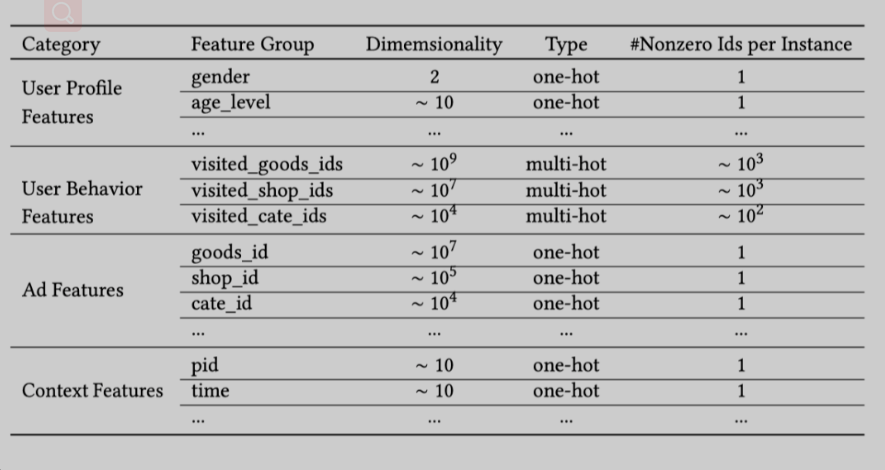
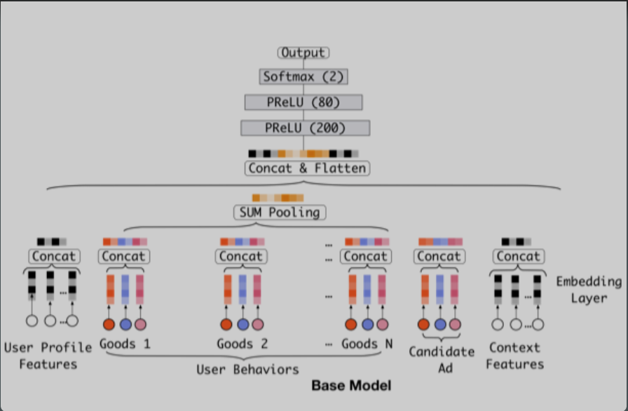
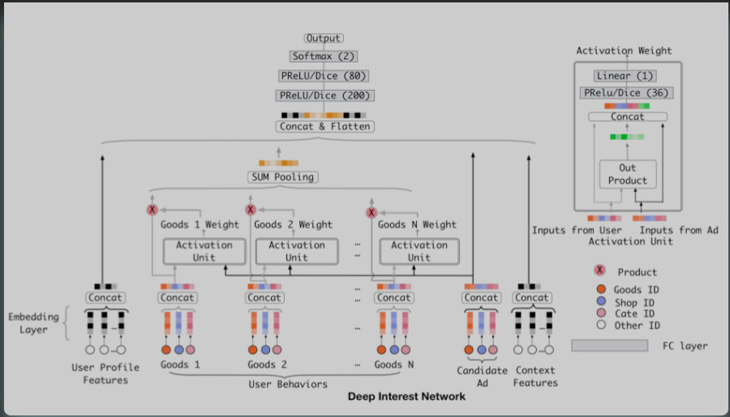

# attention 应用于 deep interest network

# 1. 特点 or 问题

- 用户的兴趣通常是多种多样的，而 Embedding & MLP 方法中有限的向量维度会成为用户多样化兴趣的瓶颈，如果扩大向量维度会极大地增加学习参数和计算负荷，并增加过拟合风险；

- 不需要将用户的所有兴趣都压缩到同一个向量中。比如说：用户购买了泳镜并不是因为上周购买了鞋子，而是因为之前购买了泳衣；

针对这些问题，DIN 模型通过考虑给定候选广告的历史行为的相关性，自适应地计算用户兴趣的表示向量。通过引入局部激活单元，DIN 模型通过软搜索历史行为的相关部分来关注相关的用户兴趣，并采用加权总和池化来获取有关候选广告的用户兴趣的表示形式。与候选广告相关性更高的行为会获得更高的激活权重，并且支配着用户兴趣。这样用户 的兴趣表示向量就会随着广告的不同而变化，从而提高了模型在有限尺寸下的表达能力，并使得模型能够更好地捕获用户的不同兴趣。

# 2. 网络构建

## 2.1 特征构建

下图为阿里构建的特征，主要为四个方面：用户特征、用户行为特征、广告特征、背景特征。

## 2.2 Base Model

其网络结构主要由 Embedding 和 MLP 构成，如下图所示。

Embedding 层： 输入的是高维二值化的稀疏向量，输出是低维的高密度向量；

Pooling 层： 由于不同用户会有不同数量的行为，所以该层输入不同数量的 Embedding 向量，输出为固定大小的向量；

MLP： 采用激活单元为 PReLU 的全连接网络；

损失函数： 交叉熵损失函数。

Base Model 有一个非常大的缺点——**用户兴趣多样化表达受限**。Base Model 直接通过池化所有的 Embedding 向量来获的一个定长的表示向量。由于表示向量长度固定，所以其表达也会受到一定的限制，假设最多可以表示 k 个独立的兴趣爱好，如果用户兴趣广泛不止 k 个则表达受限，极大的限制了用户兴趣多样化的表达，而如果扩大向量维度则会带来巨大的计算量和过拟合的风险；

## 2.3 DIN Model

基于 DIN 的网络结构如下图所示，作者认为用户行为在电商应用场景中至关重要，所以在建模时更加关注于用户行为。

DIN 针对 Base Model 的缺点提出了局部激活单元，其目的在于：在有限的特征空间中表达用户复杂的兴趣。 **DIN 将用户兴趣刻画为用户分布表示**，而不是固定的一个点，这样即使在 k 维空间也可以获得超过 k 维的表达能力。

电商的用户行为特点往往是多需求并发（Diversity）的，行为序列是多个需求子序列的并集，而当用户注意到某个商品时，其决定通常只与其一个或者部分需求有关。

在阿里的广告系统中，当用户点击商品，候选广告将通过软搜索用户的历史行为并挖掘其最近浏览过的类似商品，从而满足用户当前的相关兴趣。也就是说 DIN 是通过考虑用户的当前点击行为与历史行为的相关性来自适应地计算用户兴趣的表示向量，用户的历史行为的权重依赖于正在看的商品。

