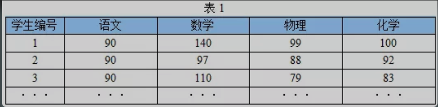
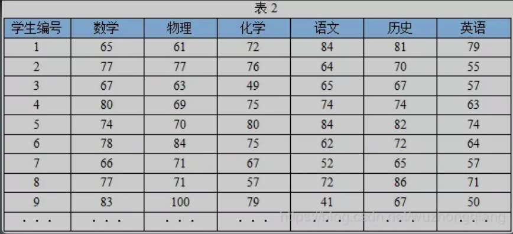
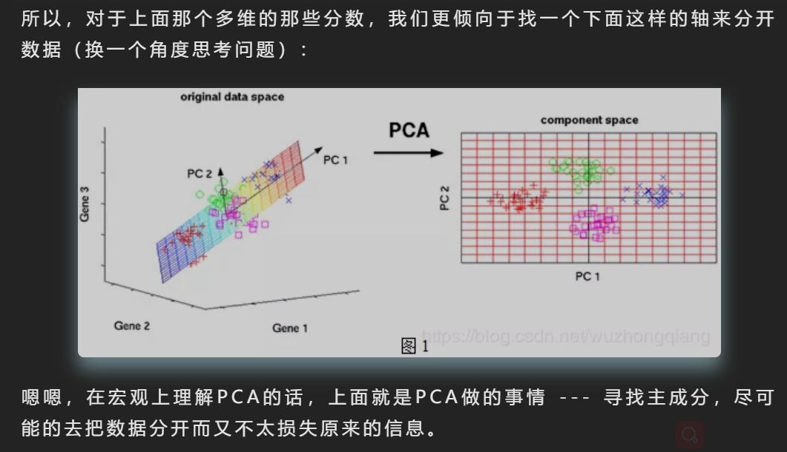
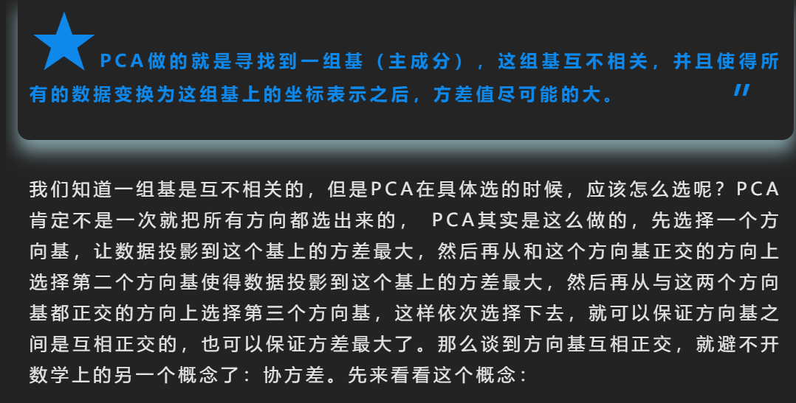
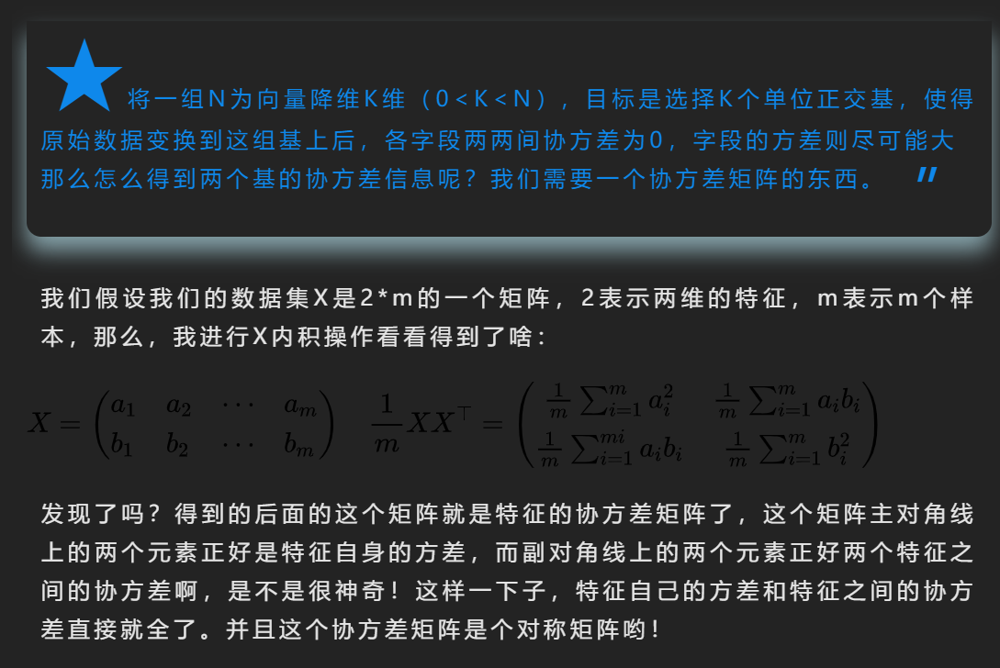
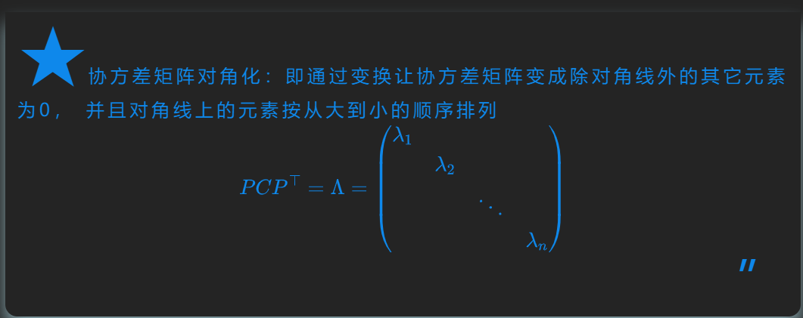
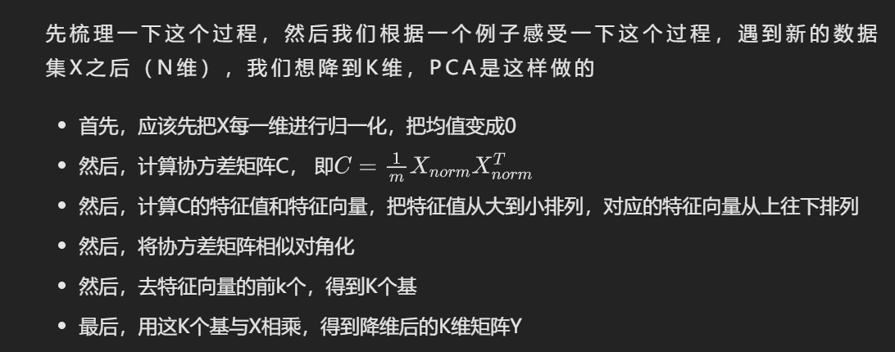
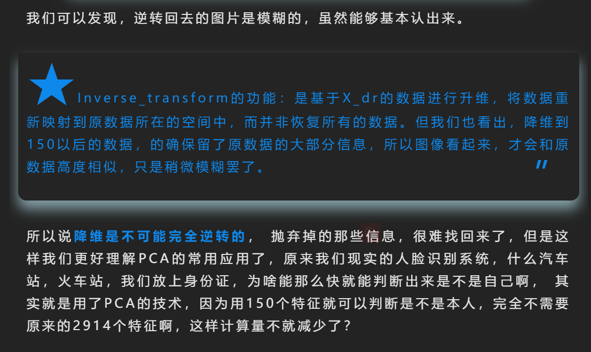

# pca

首先，假设这些科目成绩不相关，也就是说某一科目考多少分与其他科目没有关系。现在我想让你用尽量少的科目成绩来区分这三个同学学习等级的话，我想你一定不会选语文成绩作为区分的标准（因为语文分数都一样啊，没有区别啊）， 你一眼就可以看出来数学、物理、化学可以作为这组数据的主成分（很显然，数学作为第一主成分，因为数学成绩拉的最大），很大程度上我们光用数学成绩就可以区分开这三个同学吧。这和我们平时考试一样，为啥父母都喜欢说好好学数学，因为数学才能真正的拉开分决定谁考第一名。 这不，单单一门数学成绩就可以完成分类任务了，不用考虑其他三科，这不就降维了啊。

那你怎么就确定数学就是主成分的呢？  你说，因为数学拉开了分啊， 你这个拉开了分，其实就是说的这个分数在同学和同学之间的差距可能会比较大，这个正是我们概率论上常常讲的方差。方差越大，所获得的的信息量就会越多。

而PCA找主成分的时候其实在寻找K个尽可能的把样本区分开方向，即方差尽可能大的方向作为主成分，这样就可以做到在保留尽可能多的数据信息的情况下把数据的维度降到了K维（原来肯定是比K维大）

你还能一下子找出哪一科可以作为主成分吗？ 你可能又会说，这还不简单，这还不简单？你不是说了找方差极可能大的吗？我算一算每一科的方差，然后我看看哪几个方差最大不就行了？哈哈，这个地方注意不要理解错了，寻找主成分并不一定是在这原有的这几科上去找某几科方差最大的科目，而更像是这些科目的一种均衡，这啥意思？就比如，我们的每个科目都代表一个方向，那么每一个学生在空间中根据每门分数不同就成了一个个的点，我们想要找的主成分，不一定是这原来的某个方向或者某些方向，我们找的方向，是这每个学生投影上来之后能够离得尽可能的远，也就是方差尽可能大，这样有利于我们的区分。

谈到数学这一块，就得严谨一些了,我们上面知道了PCA就是去找主成分，而主成分的标准两个条件，一是互不相关（注意不相关可不等于互相独立，这里只保证没有线性关系）；二是用来描述数据的时候，方差尽可能大，也就是数据投影过去之后，离得尽可能远。

接下来，其实就是弄明白PCA是怎么去衡量这两个条件的，第一个条件的话，互不相关，可以找一组主成分使得彼此之间的协方差为0（后面会提到）， 那么第二个条件，数据投影过去之后，离得尽可能远？ 这个有点麻烦，所以看第二个之前，我们先来看看什么是投影，这个怎么衡量？

iris = load_iris()
X = iris.data   # Xshape(150, 4)

# X的归一化
X_norm = StandardScaler().fit_transform(X)
X_norm.mean(axis=0)      # 这样每一维均值为0了

from sklearn.decomposition import PCA

# 然后使用
pca = PCA(n_compoents=2)
X_new = pca.fit_transform(X_norm)

"""查看PCA的一些属性"""
print(pca.explained_variance_)    # 属性可以查看降维后的每个特征向量上所带的信息量大小（可解释性方差的大小）
print(pca.explained_variance_ratio_)  # 查看降维后的每个新特征的信息量占原始数据总信息量的百分比
print(pca.explained_variance_ratio_.sum())    # 降维后信息保留量

# 我们先得到降维后的数据
X_dr = pca.transform(faces.data)    # 这个是1358,150的数据

#然后我们调用接口逆转
X_inverse = pca.inverse_transform(X_dr)
X_inverse.shape    # （1348， 2914） 看这个形状还真回去了啊

